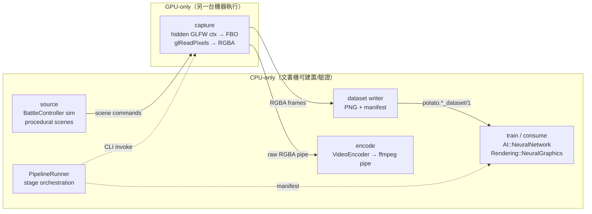

# Architecture Spine — media-pipeline

## Design Paradigm

**Pipes-and-filters** with stage-owned artifacts. Four stages form a one-way
chain; each stage reads files/manifests left by the previous stage and writes
its own. No stage shares memory or headers across the **GPU boundary** — that
boundary sits between `capture` (needs a GL context) and everything after it.



- `PotatoEngine`（含 `Rendering/`、`AI/`）不反向依賴 `Media/`。
- `Media/` 依賴 `Rendering/`、`AI/`、`Serialization/`；`Examples/` 依賴 `Media/`。
- GPU 段只產生 `output/` 工件；CPU 段只消費工件。

## Invariants & Rules

### AD-1 — GPU-dependent code lives only inside CLI executables

- **Binds:** all capture/render-to-file work, all new media-gen tooling
- **Prevents:** orchestration code accidentally linking glad/GLFW and becoming unbuildable/untestable on a machine with no GPU
- **Rule:** 任何需要 GL context 的程式碼只能出現在 `add_executable` target（不得進 `PotatoEngine`/`Media` 等 library target）；一律遵守 `[SKIP]`+exit-0 headless 慣例。`Media/` library target 不得 `target_link_libraries(... glad glfw)`。`PipelineRunner` 以子行程啟動 capture 工具，不以函式呼叫。

### AD-2 — Dataset manifests are the inter-machine contract

- **Binds:** every dataset-producing tool and every consumer
- **Prevents:** consumers hard-coding directory layouts; GPU machine and office machine drifting on formats
- **Rule:** 每個資料集目錄必含 `dataset.json`，頂層 `kind`/`schema` 欄位為 `potato.<kind>_dataset/1`；consumer 只讀 manifest 不掃目錄慣例。既有三種（`potato.video_dataset/1`、SynthDataDemo grid manifest、PortraitRenderer manifest）逐步收斂到同一欄位集——新資料集直接用統一 schema，舊工具逐案遷移，不一次強改。

### AD-3 — One shared capture/encode utility layer in `Media/`

- **Binds:** all new frame-capture and video-encoding code
- **Prevents:** the current 4–5× duplicated hidden-window + readback + row-flip pattern (and its real bug: `VideoDataDemo` PNG frames are unflipped while its bboxes are top-down)
- **Rule:** 新工具不得再手刻 hidden-window/readback/flip/ffmpeg-pipe——走 `Media/HeadlessCapture` 與 `Media/VideoEncoder`。`HeadlessCapture` 永遠輸出 top-down RGBA（翻轉語意只有一個版本）。既有工具暫不強制重構；改到時順手遷移。`VideoDataDemo` 的 unflipped-PNG defect 在遷移時修正並記錄。

### AD-4 — ffmpeg stays an external-process contract

- **Binds:** all video output
- **Prevents:** linking an encoder into the engine; ffmpeg CLI drift across call sites
- **Rule:** MP4 只經 `Media/VideoEncoder`（`_popen` rawvideo stdin pipe，現行參數集集中此檔）；引擎與 `Media/` 永不連結 libav*/編碼器。ffmpeg 不在 PATH → 工具降級為 PNG-only 並明示，不算錯。

### AD-5 — Training/inference stays in-tree CPU MLP; `.pnn` is the model format

- **Binds:** all engine-side learned models
- **Prevents:** binding the engine to an external DL framework; models exchanged as opaque binary blobs
- **Rule:** 引擎內訓練/推論只用 `AI::NeuralNetwork` + `Rendering::NeuralGraphics`（CPU）；模型交換走 `PNNv1` 文字序列化（`.pnn`）。外部 GPU 訓練（若有）是 out-of-tree consumer：吃同一批 dataset manifest，產出的權重以 `.pnn` 匯回——引擎不引入 PyTorch/ONNX 依賴。[ASSUMPTION：使用者不要外部 DL 框架]

### AD-6 — Generated artifacts live under `output/` and never enter git

- **Binds:** all pipeline output
- **Prevents:** datasets/videos committed to the repo; output paths scattered per tool
- **Rule:** 一切產物寫 `output/<pipeline>/<run_id>/`（run_id = seed 或 timestamp）；manifest 記錄 seed 保決定性；`.gitignore` 涵蓋 `output/` 下所有子目錄（含補上 `output/video_ds/`）。不得寫到 `output/` 以外。

## Consistency Conventions

| Concern | Convention |
| --- | --- |
| Naming | 管線段目錄 `Media/`；工具 `Examples/<Name>Demo|Tool.cpp`；manifest kind `potato.<noun>_dataset/1`；模型檔 `*.pnn`（`PNNv1` header） |
| Data & formats | 影格 top-down RGBA8；PNG 走 `Rendering/ImageCodec`（自研，零依賴）；JSON 一律 `Serialization/JsonParser.h` `JsonValue`；標註走 JSONL（每行一影格）或 CSV 欄位表——新資料集優先 JSONL |
| State & mutation | 段間唯讀工件；種子一律進 manifest；錯誤 = 非零 exit + stderr，GL 缺失 = `[SKIP]` + exit 0 |
| Tests | 純 CPU 段進 `POTATO_TESTS`（ctest）；GL/ffmpeg 段只建置不註冊（工具慣例）；MSVC + MinGW + Linux g++ 皆須編過 |

## Stack

| Name | Version |
| --- | --- |
| C++ | 20 |
| CMake | ≥3.15 |
| OpenGL + GLFW + glad | 現行 vendored/FetchContent |
| ffmpeg | external CLI（非連結依賴） |
| AI::NeuralNetwork (`PNNv1`) | in-tree |
| JsonValue (`Serialization/JsonParser.h`) | in-tree |

## Structural Seed

```text
MingGoRTS/
  Media/                     # 新：管線共用層（CPU-safe library）
    HeadlessCapture.h/.cpp   # hidden GLFW ctx + FBO readback + top-down flip（內部 GL，僅供 exe target 使用——見 AD-1 例外：本檔為 GL 程式碼，放 Media/ 但僅由 GL 工具連結；不進 PotatoEngine 預設連結面）
    VideoEncoder.h/.cpp      # ffmpeg _popen rawvideo pipe，單點 CLI 參數
    DatasetManifest.h/.cpp   # potato.*_dataset/1 讀寫（JsonValue）
    PipelineRunner.h/.cpp    # 段編排：讀 plan → 子行程依序啟動工具 → 驗證工件（stub）
  output/
    <pipeline>/<run_id>/     # 一切產物（gitignored）
  Examples/
    VideoDataDemo.cpp        # GPU capture 段（現存）
    SynthDataDemo.cpp        # GPU capture + CPU train（現存）
    MediaPipeDemo.cpp        # 新：PipelineRunner 驅動範例（CPU orchestration）
```

## Deferred

- **GPU 機端的批次執行/排程**——本 spine 只管「段與工件的契約」，不管遠端執行器；到要跨機器跑時再決定（rsync/共享碟/CI artifact）。
- **真正的 video/audio 生成模型**（diffusion、TTS 等）——現階段「影音生成」= 渲染影格→資料集→in-tree MLP→ffmpeg 影片；引入外部生成模型是另一個架構決策。
- **音訊產線**——`AudioTest.cpp` 存在但未接進管線；影音的「音」段待另案。
- **VideoDataDemo unflipped-PNG defect 修復時機**——隨 AD-3 遷移處理，非本 spine 交付物。
- **NeuralGraphics ↔ dataset 的標準輸入介面**——目前各工具自讀資料集；統一 `DatasetReader` 待第二批實作。

## Open Questions

- `HeadlessCapture` 放 `Media/`（GL 程式碼進 library 目錄但僅由 exe 連結）vs 放 `Rendering/`（同 RenderTarget 鄰居）——傾向前者讓 GL 邊界一眼可見，未拍板。
- `PipelineRunner` 的 plan 格式（YAML? JSON? 單純 CLI 序列？）——骨架先以 `potato.pipeline_plan/1` JSON 起步。
