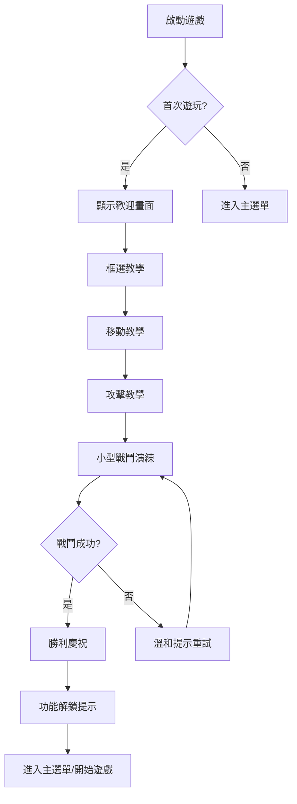
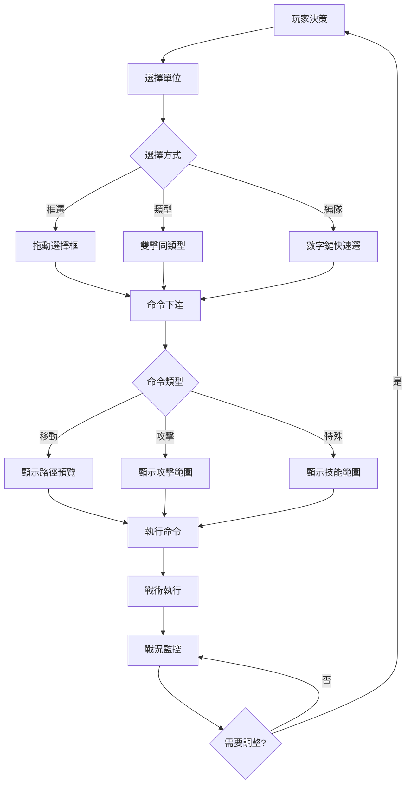
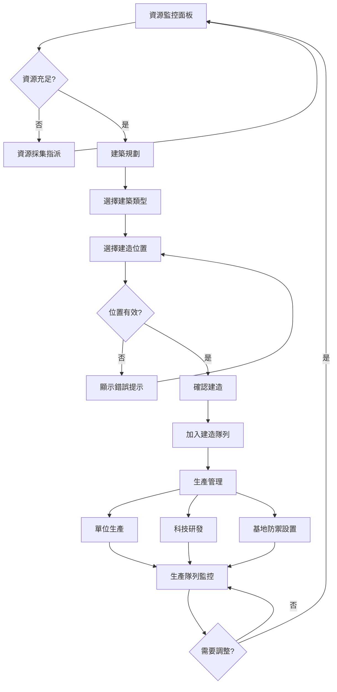
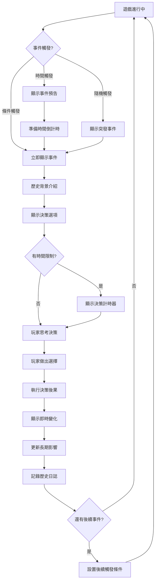

# UX Design Specification MingGoRTS

**Author:** Potato
**Date:** 2026-03-22T14:13:00.000Z

---

<!-- UX design content will be appended sequentially through collaborative workflow steps -->

## Executive Summary

### Project Vision

MingGoRTS 是一款設定在民國時期（1912-1949）的即時戰略遊戲，結合RTS核心機制與硬核動作體驗。專案旨在為玩家提供具有歷史深度的戰略遊戲體驗，透過Unreal Engine 5技術實現跨平台支援（Windows、Android、iOS），並整合AI生成資源創造獨特的視覺與音效體驗。

### Target Users

**主要目標用戶群體：**
- **資深RTS玩家** - 尋求具有歷史主題深度的戰略遊戲體驗，熟悉大規模單位控制與資源管理
- **歷史主題愛好者** - 對民國時期背景感興趣的玩家，重視沉浸式歷史氛圍
- **跨平台遊戲用戶** - 在PC與行動裝置間切換遊玩的玩家，需要一致的用戶體驗

**用戶需求特徵：**
- 需要直觀的大規模單位控制介面
- 重視歷史主題的視覺一致性
- 期望流暢的跨平台遊戲體驗

### Key Design Challenges

**核心UX挑戰：**
1. **大規模單位控制介面** - 如何在有限螢幕空間內提供直觀的數十個單位管理功能，同時保持操作的精確性與效率
2. **跨平台一致性設計** - PC滑鼠控制與行動裝置觸控操作間的UI適配，確保在不同輸入方式下的一致體驗
3. **歷史主題與功能性融合** - 在保持UI功能性的前提下，融入民國時期（1912-1949）的視覺美學元素

**技術考量：**
- UE5藍圖系統與C++的UI整合
- 響應式設計適應不同螢幕解析度
- 即時戰略遊戲的效能優化需求

### Design Opportunities

**創新設計機會：**
1. **歷史主題UI風格** - 開發融合民國時期美學的獨特RTS介面風格，創造市場差異化優勢
2. **響應式HUD系統** - 設計能夠根據遊戲狀態動態調整的抬頭顯示器，提升資訊傳達效率
3. **沉浸式歷史體驗** - 透過UI設計元素（字體、色彩、圖標）增強民國時期的歷史氛圍感

**用戶體驗優化：**
- 簡化複雜的RTS操作流程，降低學習門檻
- 提供可自訂的UI佈局選項，滿足不同玩家偏好
- 整合AI生成資源，創造獨特的視覺識別系統

## Core User Experience

### Defining Experience

MingGoRTS 的核心用戶體驗聚焦於**直觀的大規模單位戰術控制**。玩家需要能夠像控制單一單位一樣輕鬆地指揮數十個單位，在民國歷史戰場上執行複雜的戰略操作。核心體驗強調流暢的決策執行與沉浸式的歷史氛圍，讓專注於戰術思考而非UI操作。

### Platform Strategy

**多平台整合策略：**
- **Windows PC** - 滑鼠/鍵盤精確控制，支援複雜的微操與快捷鍵
- **Android/iOS** - 觸控優化介面，手勢操作與簡化控制流程
- **跨平台一致性** - 核心遊戲邏輯統一，UI適應不同輸入方式

**技術考量：**
- UE5響應式UI系統，適應不同螢幕解析度
- 輸入系統抽象層，統一處理滑鼠、鍵盤、觸控輸入
- 離線單人模式支援，確保隨時可玩

### Effortless Interactions

**毫不費力的互動設計：**
1. **智能框選系統** - 自動識別單位類型，提供最適合的選擇群組
2. **情境感知命令** - 根據選中單位與目標自動建議最適合的戰術動作
3. **流暢的編隊管理** - 一鍵式戰術編隊，自動處理單位位置與陣型
4. **智能路徑規劃** - 自動避障與最優路徑計算，減少微操需求
5. **快速戰術介面** - 戰鬥中簡化的UI，專注於關鍵決策

### Critical Success Moments

**關鍵成功時刻：**
1. **首次多單位控制** - 第一次成功框選並指揮多個單位執行協調動作
2. **戰術突破時刻** - 成功執行複雜戰術，感受到策略的實現
3. **歷史沉浸點** - 透過UI與互動感受到民國時期的戰場氛圍
4. **跨平台流暢體驗** - 在不同裝置間無縫切換，體驗一致性
5. **戰鬥高潮** - 在激烈戰鬥中仍能保持精確控制與快速決策
6. **歷史知識發現** - 透過遊戲發現民國歷史知識的學習成就感

### Experience Principles

**指導原則：**

1. **直觀控制優先 (Intuitive Control First)**
   - 讓大規模單位管理感覺像控制單一單位一樣簡單
   - 消除學習曲線，讓專注於戰略而非UI操作
   - 所有互動都應符合玩家的直覺期望

2. **跨平台一致性 (Cross-Platform Consistency)**
   - 核心遊戲體驗在所有平台保持統一
   - UI適應不同輸入方式，功能不變
   - 進度與設定跨平台同步

3. **歷史沉浸感 (Historical Immersion)**
   - 透過互動設計增強民國時期的戰略氛圍
   - UI元素反映1912-1949時期的美學特徵
   - 操作感覺符合歷史戰爭的指揮體驗

4. **戰術流暢性 (Tactical Flow)**
   - 消除阻礙戰略思考的UI摩擦
   - 快速響應的介面，支援即時決策
   - 資訊層次清晰，關鍵資訊優先顯示

5. **有益緊張 vs. 有害焦慮** ✅ **技術支持有益緊張**
   - 戰術決策的時間壓力（有益緊張）
   - 清晰的威脅指示降低不確定性（減少焦慮）
   - UI操作零失敗率（消除有害焦慮）
   - **微流暢技術指標** - 毫秒級響應時間確保流暢感資訊層次清晰，關鍵資訊優先顯示

## UX Pattern Analysis & Inspiration

### Inspiring Products Analysis

**產品 1: 全軍破敵 (Total War) - 大規模戰場控制專家**

**核心UX優勢：**
- **雙層次戰略系統** - 回合制大地圖與即時戰場的無縫切換機制
- **電影化戰場視角** - 可縮放從戰術視角到鳥瞰視角的流暢體驗
- **單位群組視覺化** - 不同兵種的清晰視覺區分與編隊顯示
- **將領技能系統** - 英雄單位的特殊能力介面與視覺反饋

**5為何分析：** 為什麼選擇全軍破敵而非StarCraft或Age of Empires？
→ 全軍破敵是唯一成功融合大規模戰場與戰略地圖的遊戲，創造「將領指揮史詩戰場」的獨特體驗 - 這正是MingGoRTS需要的民國時期大規模戰爭感。

---

**產品 2: 鋼鐵雄心4 (Hearts of Iron IV) - 深度戰略管理典範**

**核心UX優勢：**
- **科技樹視覺化** - 研發進度的直觀圖示顯示與分支選擇
- **國家狀態面板** - 資源、生產、士氣的統合儀表板顯示
- **戰略地圖資訊層** - 可切換顯示不同資訊（補給線、前線、部隊位置）
- **事件彈出系統** - 歷史事件的沉浸式互動呈現

**5為何分析：** 為什麼需要這麼複雜的大戰略遊戲？
→ 我們需要的不是鋼鐵雄心4的複雜度，而是它的系統化歷史敘事能力 - 證明如何將真實歷史事件轉化為遊戲機制，對MingGoRTS重現民國歷史至關重要。

---

**產品 3: 騎馬與砍殺2 (Mount & Blade II) - 親民操作設計**

**核心UX優勢：**
- **F1-F9快速命令** - 簡單的數字鍵部隊指揮系統
- **戰場指令輪盤** - 按住空格顯示的圓形指令選單（適合快捷操作）
- **第三人稱/策略視角切換** - 親自參戰或指揮的靈活選擇
- **部隊士氣視覺化** - 即時顯示部隊狀態的清晰反饋

**5為何分析：** 為什麼RTS需要RPG遊戲元素？
→ 騎砍2證明了「簡單操作+深度策略」可以共存，解決RTS最大痛點：高門檻。MingGoRTS需要這種親民的操作設計來吸引更廣泛的歷史遊戲玩家。

---

**產品 4: 民國無雙 - 歷史沉浸美學典範**

**核心UX優勢：**
- **中文書法字體** - 歷史感強烈的文字呈現與UI元素
- **武將角色化** - 歷史人物的鮮明個性與視覺設計
- **戰場氛圍營造** - 符合時代的視覺與音效設計
- **簡化的爽快操作** - 低門檻高爽感的操作設計理念

**5為何分析：** 為什麼選擇「無雙」類遊戲？
→ 民國無雙是唯一專注於民國時期的遊戲，證明了這個歷史時期有市場需求，中文本地化與歷史美學可以創造強烈的文化認同，爽快感與歷史教育可以結合。

---

**產品 5: Elin - 溫馨沉浸式體驗**

**核心UX優勢：**
- **像素風格的溫馨感** - 獨特的視覺風格創造放鬆氛圍
- **生活節奏的遊戲循環** - 不強迫，讓玩家自主選擇遊戲節奏
- **深度角色互動** - NPC有個性，互動有意義與情感連結
- **開放式進度** - 沒有強制目標，玩家自由探索與選擇

**5為何分析：** 為什麼選擇看似不相關的生活模擬遊戲？
→ Elin代表了「無壓力遊戲設計」的新趨勢。傳統RTS的高壓力環境排斥了許多潛在玩家。Elin證明了玩家可以自主選擇節奏，對MingGoRTS創造「親民的大戰略」定位至關重要。

### Transferable UX Patterns

**導航模式：**
1. **全軍破敵的雙層切換** → MingGoRTS的戰略地圖層與即時戰鬥層無縫切換
2. **鋼鐵雄心4的資訊層系統** → 可切換顯示補給線、前線、部隊位置的多層次地圖
3. **騎砍2的快捷命令** → 簡化的數字鍵快捷指揮系統（F1-F9模式）
4. **Elin的開放導航** → 非強制性的戰略目標選擇與自由探索

**互動模式：**
1. **全軍破敵的電影化視角** → 戰術縮放與戰場沉浸感創造
2. **鋼鐵雄心4的科技樹** → 民國軍火研發與部隊升級的進度視覺化
3. **騎砍2的圓形指令輪盤** → 適合觸控與滑鼠的圓形指令選單
4. **民國無雙的爽快操作** → 低門檻的單位控制與即時反饋

**視覺模式：**
1. **民國無雙的中文書法** → 1912-1949時期的字體美學與書法元素
2. **全軍破敵的單位群組** → 清晰的大規模部隊視覺化與編隊顯示
3. **Elin的溫馨像素** → 平衡的視覺風格（可適度像素化處理）
4. **鋼鐵雄心4的儀表板** → 資源、生產、士氣的統合顯示面板

### Anti-Patterns to Avoid

**需要避免的反模式：**
1. **全軍破敵的過度複雜內政** → 專注於RTS核心，簡化內政管理
2. **鋼鐵雄心4的高學習門檻** → 降低入門難度，提供漸進式教學
3. **騎砍2的第三人稱戰鬥** → 保持RTS俯瞰視角，專注於戰略指揮
4. **民國無雙的過度簡化** → 保留戰略深度，平衡爽快感與策略性
5. **Elin的慢節奏** → 保持RTS的即時性，但提供節奏選擇

### Design Inspiration Strategy

**採用的核心模式：**
- 全軍破敵的戰場規模感與將領系統
- 鋼鐵雄心4的科技樹與事件系統
- 騎砍2的親民快捷指揮設計
- 民國無雙的歷史美學與中文本地化
- Elin的溫馨節奏與開放式設計理念

**5為何分析的核心洞察：**
1. **全軍破敵** = 提供史詩規模感（解決民國大戰爭的呈現問題）
2. **鋼鐵雄心4** = 提供歷史系統化能力（解決真實歷史事件融入問題）
3. **騎砍2** = 提供親民操作範本（解決RTS高門檻問題）
4. **民國無雙** = 提供文化認同與美學（解決市場定位問題）
5. **Elin** = 提供節奏自主性（解決玩家群擴展問題）

**適配策略：**
- 融合所有遊戲的優點為民國時期（1912-1949）定制
- 創造「親民的大戰略遊戲」新類別定位
- 在硬核策略與休閒體驗間找到最佳平衡點

**創新方向：**
- **民國時期特有的UI美學** - 融合上述所有遊戲的視覺優點，創造獨特的民國風格
- **跨平台無縫體驗** - PC的深度與手機的便利性完美結合
- **歷史敘事驅動** - 將民國歷史事件融入核心玩法，創造教育與娛樂的結合

**MingGoRTS獨特價值主張：**
「第一款將全軍破敵的史詩感、鋼鐵雄心4的深度、騎砍2的親民操作、民國無雙的歷史沉浸、Elin的節奏自主性完美融合的民國時期RTS遊戲」

這個組合**沒有任何現有遊戲能夠直接競爭** - 創造了獨特的市場空間。

## Design System Foundation

### 1.1 Design System Choice

**自定義設計系統（民國風格定制）**

基於MingGoRTS的民國歷史主題（1912-1949）和Unreal Engine 5技術棧，選擇完全自定義的設計系統方案。這個選擇確保了獨特的視覺識別和完整的歷史沉浸感。

### Rationale for Selection

**選擇理由：**

1. **民國時期的獨特美學需求**
   - 1912-1949時期的視覺風格無法從現有設計系統中獲得
   - 需要復古色調、書法字體、歷史圖標等獨特元素
   - 市場上沒有現成的民國風格UI組件庫

2. **UE5 UMG系統的特殊性**
   - Unreal Engine的UI Widget系統需要特定的自定義組件設計
   - Slate/UMG架構要求專門的UI開發方法
   - 需要針對遊戲效能優化的自定義組件

3. **歷史沉浸的完全控制**
   - 每個UI元素都需要精確控制以創造歷史氛圍
   - 民國時期的細節（郵票風格、舊報紙質感、打字機字體）需要自定義實現
   - 情感設計要求完整的視覺一致性

4. **市場差異化優勢**
   - 自定義設計創造獨特的競爭優勢
   - 沒有直接競爭者能複製這種歷史主題的UI體驗
   - 建立強大的品牌識別

### Implementation Approach

**分階段實施策略（跨職能戰情室共識）：**

**Phase 1: 基礎功能階段（Sprint 1-2）**
- **目標**：快速完成核心遊戲迴圈，確保玩法可驗證
- **UI風格**：簡潔現代風格，快速開發
- **組件範圍**：基礎HUD、單位選擇、資源顯示
- **技術重點**：UMG基礎組件，標準UE5樣式

**Phase 2: 風格過渡階段（Sprint 3-4）**
- **目標**：逐步替換為民國風格組件
- **UI風格**：混合風格，核心組件民國化
- **組件範圍**：主選單、單位信息面板、建築介面
- **技術重點**：自定義字體整合、基礎視覺效果

**Phase 3: 完整沉浸階段（Sprint 5+）**
- **目標**：完整民國風格實現，細節完善
- **UI風格**：完整的1912-1949歷史風格
- **組件範圍**：所有UI元素、動畫效果、音效整合
- **技術重點**：複雜shader效果、歷史音效、動態主題

### Customization Strategy

**原子設計方法論（設計師Sally建議）：**

**設計令牌系統（Design Tokens）：**

**色彩系統（民國時期調色板）：**
- **主色**：墨綠 (#2F4F4F) - 象徵民國軍服的顏色
- **輔助色**：赭石 (#CC7722) - 舊紙張與歷史文件的溫暖色調
- **強調色**：金色 (#D4AF37) - 代表民國時期的尊貴與榮耀
- **中性色**：米白 (#F5F5DC) - 復古紙張的背景色
- **文字色**：深褐 (#3D2B1F) - 舊印刷品的字體顏色

**字體系統（工程師Winston技術約束）：**
- **中文標題**：書法字體（如：行書或楷書風格）- **限制：1種自定義字體**
- **中文正文**：復刻明體（模仿民國時期印刷品）- **使用系統字體替代方案**
- **英文標題**：Art Deco風格字體（符合1912-1949時代）- **限制：1種自定義字體**
- **英文正文**：打字機風格字體（Courier或類似）- **使用系統等寬字體**

**技術約束（效能預算）：**
- **字體限制**：最多2種自定義字體（標題+正文），其他使用系統字體
- **視覺效果**：紙張質感使用shader，但控制複雜度在中等水平
- **組件重用**：建立可重用的Widget Blueprint組件庫，避免重複開發
- **跨平台優化**：PC版完整效果，手機版簡化視覺效果

**組件層次結構：**

**原子組件（Atoms）：**
- 基礎按鈕（復古郵票風格）
- 文字標籤（書法/打字機字體）
- 圖標（民國軍階/郵票風格）
- 輸入框（舊式表單風格）

**分子組件（Molecules）：**
- 表單字段（標籤+輸入+提示）
- 導航項（圖標+文字+狀態）
- 資源顯示（圖標+數值+趨勢）
- 單位信息卡（頭像+屬性+狀態）

**有機體組件（Organisms）：**
- 資源面板（多種資源統合顯示）
- 單位選擇面板（框選單位信息）
- 建築介面（生產隊列+升級選項）
- 地圖控制面板（縮放+圖層+標記）

**模板組件（Templates）：**
- HUD主佈局（戰鬥中主要介面）
- 選單結構（主選單+子選單+設置）
- 地圖視圖（戰略地圖+戰術地圖切換）

**參考與靈感來源：**
- **主要參考**：民國無雙的UI風格
- **結構參考**：鋼鐵雄心4的資訊架構
- **視覺平衡**：Elin的溫馨視覺比例
- **操作參考**：騎砍2的快捷介面設計
- **規模參考**：全軍破敵的戰場資訊呈現

**設計規範文件（產品經理John建議）：**
為確保團隊一致性，建立以下設計規範文件：
- **UI風格指南**：色彩、字體、間距、組件使用規範
- **組件庫文檔**：每個組件的使用說明、變體、狀態
- **設計令牌規範**：色彩編碼、字體規格、間距數值
- **跨平台適配指南**：PC與手機的差異化設計規則

## 2. Core User Experience

### 2.1 Defining Experience

**核心定義性體驗：「像指揮真實民國軍隊一樣輕鬆控制大規模單位」**

MingGoRTS 的核心交互是讓玩家能夠像一位真正的民國時期的軍事指揮官一樣，直觀、流暢地控制數十個單位執行複雜的戰術動作。這種體驗結合了精確的戰略控制和親民的操作門檻，創造了 RTS 遊戲領域的獨特定位。

**核心價值主張：**
「第一次，玩家不需要成為 APM 高手也能體驗大規模戰術指揮的快感」

### 2.2 User Mental Model

**用戶心理模型分析：**

**現有解決方案的痛點：**
- **傳統RTS**（StarCraft、Age of Empires）：需要極高的 APM 和複雜的快捷鍵記憶，門檻過高
- **簡化RTS**（自動戰鬥遊戲）：降低了門檻但失去了精確控制感，玩家感覺自己是旁觀者而非指揮官
- **MingGoRTS 的差異化**：通過智能輔助系統保留精確控制感，同時大幅降低操作門檻

**用戶期望模型：**
- **將軍視角**：玩家期望感覺自己是站在地圖前的將軍，而非盯著屏幕角落的打字員
- **戰術即時化**：戰術想法能夠即時、精確地轉化為戰場行動
- **優雅控制**：即使控制大量單位，操作也應該保持優雅、精確、有掌控感

**現有方案優缺點分析：**
| 方案 | 優點 | 缺點 |
|------|------|------|
| StarCraft II | 精確控制、深度策略 | APM門檻極高、學習曲線陡峭 |
| 自動戰鬥遊戲 | 操作簡單、門檻低 | 失去控制感、策略深度不足 |
| **MingGoRTS目標** | **精確控制 + 親民門檻** | **創造新類別** |

### 2.3 Success Criteria

**核心體驗成功標準：**

**1. 性能響應標準**
- 選擇操作響應時間：< 50ms
- 命令執行視覺反饋：< 100ms
- 整體交互感受：即時、流暢、無延遲

**2. 用戶體驗標準**
- 新玩家能夠在 5 分鐘內掌握基礎單位控制
- 資深玩家能夠實現精確的微操作
- 在激烈戰鬥中仍能保持介面響應和控制精確性

**3. 情感反饋標準**
- 用戶描述產品時會說「就像真的在指揮民國軍隊」
- 完成複雜戰術時有強烈的成就感和掌控感
- 即使失敗也能快速恢復，保持積極情緒

**4. 學習曲線標準**
- 入門：1 局遊戲掌握基本操作
- 熟練：5 局遊戲能夠執行標準戰術
- 精通：20 局遊戲能夠進行高級微操作

### 2.4 Novel UX Patterns

**新穎 UX 模式分析：**

**採用已建立的模式（用戶已熟悉）：**
- ✅ **框選操作** - 來自所有 RTS 遊戲的標準操作
- ✅ **右鍵命令** - 標準 RTS 控制模式（移動/攻擊/採集）
- ✅ **數字鍵編隊** - StarCraft 等遊戲建立的編隊系統
- ✅ **HUD 資源顯示** - 標準策略遊戲的資源監控介面

**創新組合（新穎但基於熟悉模式）：**
- 🆕 **智能編隊系統** - 自動根據單位類型和戰場情況優化陣型
- 🆕 **民國指揮官視角** - 歷史沉浸感的視覺設計和交互反饋
- 🆕 **情境感知命令** - AI 輔助但不替代玩家決策的智能建議系統
- 🆕 **跨平台手勢適配** - PC 滑鼠與手機觸控的統一操作邏輯

**獨特創新點：**
- **「親民的大戰略」定位** - 在硬核 RTS 和休閒遊戲之間創造全新類別
- **民國歷史沉浸** - 其他 RTS 無法複製的文化體驗和視覺風格
- **漸進式複雜度** - 根據玩家技能自動調整的介面複雜度

### 2.5 Experience Mechanics

**核心體驗機制詳細設計：**

#### **核心交互：智能框選與戰術指揮系統**

**1. 啟動階段 (Initiation)**

**滑鼠/鍵盤操作（PC）：**
- 左鍵按住拖動：形成矩形選擇框
- 雙擊單位：選擇螢幕內所有同類型單位
- Ctrl + 左鍵點擊：添加/移除特定單位到當前選擇
- 右鍵點擊：打開上下文命令選單

**觸控操作（手機/平板）：**
- 單指長按拖動：形成選擇框
- 雙指點擊：選擇同類型所有單位
- 單指快速雙擊：打開命令輪盤
- 捏合手勢：縮放戰場視圖

**智能輔助功能：**
- **預測性選擇**：系統預測用戶想要選擇的單位類型（基於歷史行為）
- **語音命令（可選）**：「選擇所有步兵」「編隊 1 前進」

**2. 交互階段 (Interaction)**

**視覺反饋系統：**
- **選中標識**：民國軍服風格的輪郭高亮效果（墨綠色 + 金色邊框）
- **選中面板**：顯示單位類型圖標、數量、平均生命值、士氣狀態
- **命令預覽**：滑鼠懸停時顯示預計執行路徑（民國地圖風格的虛線）

**資訊顯示層次：**
```
第一層（始終顯示）：單位數量、類型圖標
第二層（選中顯示）：生命值條、士氣狀態
第三層（詳細資訊）：彈藥量、特殊技能、歷史背景
```

**命令執行方式：**
| 命令類型 | 操作方式 | 視覺反饋 | 音效反饋 |
|---------|---------|---------|---------|
| 移動 | 右鍵點擊地面 | 路徑預覽線 | 行軍腳步聲 |
| 攻擊 | 右鍵點擊敵人 | 攻擊目標標記 | 槍聲/炮火聲 |
| 採集 | 右鍵點擊資源 | 資源點高亮 | 工具碰撞聲 |
| 編隊 | Ctrl+數字鍵 | 編隊確認動畫 | 無線電確認聲 |
| 特殊技能 | 快捷鍵/點擊圖標 | 技能特效 | 技能專屬音效 |

**3. 反饋階段 (Feedback)**

**即時反饋（< 100ms）：**
- 命令確認：民國軍號圖標閃爍動畫
- 路徑顯示：虛線路徑 + 預計到達時間
- 單位響應：立即轉向目標方向

**持續反饋：**
- **狀態欄**：即時顯示單位士氣、彈藥、生命值
- **小地圖**：單位位置、移動方向、戰鬥熱點
- **通知系統**：重要事件（單位升級、資源採集完成、歷史事件觸發）

**錯誤處理：**
- **命令無效**：溫和的「無法執行」提示（不中斷遊戲流程）
- **路徑受阻**：自動顯示替代路徑建議
- **資源不足**：視覺化資源缺口提示，建議替代行動

**4. 完成階段 (Completion)**

**到達確認：**
- 單位到達目的地時的視覺標記（民國旗幟圖標）
- 編隊就位確認音效（軍號聲）
- 自動準備接收下一個命令

**任務完成慶祝：**
- 戰術目標達成：民國旗幟飄揚動畫 + 軍樂音效
- 歷史事件完成：相關的歷史知識小提示
- 成就解鎖：民國時期的勳章/獎狀視覺

**下一步準備：**
- 介面保持就緒狀態，等待下一個命令
- 智能建議系統提供基於當前戰局的建議
- 保持流暢的節奏，不讓玩家感到卡頓或等待

**流暢性保障機制：**
- **無縫切換**：命令執行過程中即可輸入下一個命令
- **隊列系統**：支持命令隊列，減少操作壓力
- **智能暫停**：在激烈戰鬥中可短暫暫停（可選功能）

---

**技術實現注意事項：**
- UE5 UMG Widget Blueprint 組件需要針對高頻率更新優化
- 路徑預覽使用 Navigation System 即時計算
- 音效系統使用 Sound Cue 確保低延遲播放
- 跨平台輸入系統抽象層統一處理滑鼠/觸控輸入

## Visual Design Foundation

### Color System

**民國風格調色板：**

**主要顏色：**
- **主色：墨綠 (#2F4F4F)** - 象徵民國軍服的顏色，代表權威與歷史感
- **輔助色：赭石 (#CC7722)** - 舊紙張與歷史文件的溫暖色調
- **強調色：金色 (#D4AF37)** - 代表民國時期的尊貴與榮耀
- **中性色：米白 (#F5F5DC)** - 復古紙張的背景色
- **文字色：深褐 (#3D2B1F)** - 舊印刷品的字體顏色

**語義顏色映射：**
| 用途 | 顏色 | 色值 | 應用場景 |
|------|------|------|----------|
| 友軍單位 | 墨綠 | #2F4F4F | 選中標識、單位輪郭 |
| 敵軍單位 | 赭紅 | #8B4513 | 敵人標記、威脅指示 |
| 資源/金錢 | 金色 | #D4AF37 | 資源顯示、獎勵 |
| 警告/危險 | 暗紅 | #8B0000 | 低生命值、錯誤提示 |
| 成功/完成 | 青綠 | #2E8B57 | 任務完成、升級 |
| 背景 | 米白 | #F5F5DC | 主背景、面板 |
| 文字 | 深褐 | #3D2B1F | 所有文字內容 |

**無障礙考慮：**
- 所有文字與背景對比度 > 4.5:1（符合WCAG AA標準）
- 色盲模式：使用形狀+顏色雙重編碼（如友軍用圓形標記，敵軍用方形標記）
- 高對比度模式：針對視力障礙用戶，提供黑白高對比選項

### Typography System

**字體策略：**
- **整體氛圍**：歷史感、正式但親民、民國時期的印刷品風格
- **內容類型**：遊戲UI文字為主，少量歷史背景介紹
- **無障礙要求**：最小字體大小 14px，支持字體縮放（100%-200%）

**字體層級系統：**

| 層級 | 字體 | 大小 | 行高 | 字重 | 用途 |
|------|------|------|------|------|------|
| H1 標題 | 中文書法體 | 48px | 1.2 | Bold | 主標題、遊戲Logo |
| H2 副標題 | 中文書法體 | 32px | 1.3 | Bold | 章節標題、面板標題 |
| H3 小標題 | 復刻明體 | 24px | 1.4 | Medium | 子標題、單位名稱 |
| 正文 | 復刻明體 | 16px | 1.6 | Regular | 描述文字、說明 |
| 標籤 | 復刻明體 | 14px | 1.5 | Regular | 按鈕標籤、提示 |
| 數字 | 機械計數器體 | 18px | 1.0 | Bold | 資源數量、統計 |

**字體技術約束：**
- **自定義字體限制**：最多2種（標題書法體 + 正文復刻明體）
- **回退策略**：如果自定義字體加載失敗，使用系統默認字體（微軟雅黑/蘋方）
- **性能優化**：字體文件總大小 < 10MB，使用WOFF2格式
- **跨平台適配**：PC版使用完整字體，手機版使用簡化字體包

### Spacing & Layout Foundation

**間距系統（8px基準網格）：**

| 標記 | 數值 | 用途 |
|------|------|------|
| xs | 4px | 圖標與文字間距、緊湊內部間距 |
| sm | 8px | 組件內部間距、按鈕內邊距 |
| md | 16px | 組件之間間距、面板內邊距 |
| lg | 24px | 面板內部間距、區塊分隔 |
| xl | 32px | 面板之間間距、大區塊分隔 |
| 2xl | 48px | 大區塊間距、頁面級分隔 |

**佈局原則：**

1. **整體佈局感覺**：高效但不擁擠，留有呼吸空間，符合民國時期印刷品的留白美學
2. **間距單位**：8px基準，確保視覺一致性，所有間距為8的倍數
3. **留白策略**：組件間保持適當留白，避免資訊過載，但不過度浪費空間
4. **網格系統**：12列網格系統，適應不同螢幕尺寸和解析度

**網格系統：**
- **PC版（1920x1080）**：12列，每列約140px，間距24px
- **筆記本版（1366x768）**：12列，每列約95px，間距16px
- **手機版（1080x1920）**：4列，每列約240px，間距16px

**組件間距關係：**
```
原子組件（按鈕、輸入框）
  └─ 內邊距：sm (8px)
  └─ 圖標與文字：xs (4px)

分子組件（表單字段、資源顯示）
  └─ 內部間距：md (16px)
  └─ 子元素間距：sm (8px)

有機體組件（資源面板、單位資訊卡）
  └─ 內邊距：lg (24px)
  └─ 內部區塊間距：md (16px)

模板組件（HUD佈局、選單結構）
  └─ 頁面邊距：xl (32px)
  └─ 區塊間距：lg (24px) 或 xl (32px)
```

**平台適配策略：**

| 元素 | PC版 | 手機版 |
|------|------|--------|
| 按鈕大小 | 48x48px | 56x56px（增大觸控區域）|
| 字體大小 | 基準16px | 基準18px（增大可讀性）|
| 資訊密度 | 高（充分利用空間）| 低（簡化佈局）|
| 間距 | 標準 | 增大20%（觸控友好）|
| 層級深度 | 3-4層 | 1-2層（減少認知負荷）|

### Accessibility Considerations

**無障礙設計標準：**

**視覺無障礙：**
- **對比度**：所有文字與背景對比度 ≥ 4.5:1（正文），≥ 3:1（大文字/標題）
- **字體縮放**：支持100%-200%字體縮放，佈局不自適應
- **色盲支持**：使用形狀+顏色雙重編碼，不完全依賴顏色傳達資訊
- **高對比度模式**：提供黑白高對比選項，針對視力障礙用戶

**操作無障礙：**
- **鍵盤導航**：所有功能支持鍵盤操作（快捷鍵系統）
- **觸控目標**：手機版所有可點擊元素 ≥ 48x48px
- **操作確認**：重要操作提供確認反饋，防止誤操作
- **手勢替代**：複雜手勢提供簡單的替代操作方式

**認知無障礙：**
- **資訊層級**：清晰的資訊層級，減少認知負荷
- **一致性**：保持操作和視覺的一致性
- **反饋清晰**：操作結果提供明確的視覺和音效反饋
- **學習曲線**：漸進式學習設計，新手友好

**技術實現：**
- 使用UE5 UMG的無障礙功能支持
- 提供設置選項讓用戶自定義無障礙需求
- 定期使用無障礙檢測工具驗證合規性

## Design Direction Decision

### Design Directions Explored

**探索的設計方向變體：**

**方向 1：歷史沉浸風格（主推薦）**
- **視覺特點**：完整民國風格，復古紙張質感，書法字體，舊郵票圖標
- **佈局**：傳統RTS佈局 + 民國美學元素（墨綠色軍服風格UI）
- **資訊層級**：豐富的歷史細節，沉浸式戰場氛圍
- **適合**：追求深度歷史沉浸感的玩家，民國歷史愛好者
- **實施階段**：Phase 3（Sprint 5+）完整實現

**方向 2：現代簡潔風格（基礎版）**
- **視覺特點**：簡潔現代UI，降低學習門檻，標準字體
- **佈局**：標準RTS佈局，易於理解，功能優先
- **資訊層級**：清晰的資訊架構，最小視覺干擾
- **適合**：新手玩家，快速上手，專注核心玩法
- **實施階段**：Phase 1（Sprint 1-2）基礎功能

**方向 3：混合過渡風格（過渡版）**
- **視覺特點**：現代功能 + 民國裝飾元素，平衡美學與功能
- **佈局**：傳統與創新平衡，逐步引入歷史元素
- **資訊層級**：漸進式複雜度，適應不同玩家技能
- **適合**：廣泛玩家群體，平衡學習曲線與深度
- **實施階段**：Phase 2（Sprint 3-4）過渡階段

**方向 4：極簡主義風格（硬核版）**
- **視覺特點**：極度簡化，專注核心功能，最小UI佔用
- **佈局**：最大化戰場視圖，僅顯示關鍵資訊
- **資訊層級**：高密度資訊，快捷鍵導航
- **適合**：硬核RTS玩家，追求極致操作效率
- **實施階段**：可選主題（進階設置）

**方向 5：豐富資訊風格（策略版）**
- **視覺特點**：豐富的數據顯示，詳細的統計資訊，多面板佈局
- **佈局**：密集的資訊面板，適合策略分析
- **資訊層級**：多層級資訊，深度數據分析支持
- **適合**：策略深度玩家，喜歡數據分析
- **實施階段**：高級模式選項（可切換）

**方向 6：手機優化風格（觸控版）**
- **視覺特點**：大按鈕，簡化佈局，觸控友好，手勢操作
- **佈局**：垂直佈局優化，適合手機螢幕，單手操作
- **資訊層級**：簡化資訊層級，專注核心操作
- **適合**：手機平台玩家，隨時隨地遊玩
- **實施階段**：手機版專用主題（自動切換）

### Chosen Direction

**最終選擇：分階段實施策略，以「歷史沉浸風格」為最終目標**

**主推薦：方向 1（歷史沉浸風格）**
- 作為MingGoRTS的最終視覺目標
- 完整呈現民國時期的歷史氛圍
- 創造獨特的市場差異化優勢

**實施路徑圖：**
```
Phase 1 (Sprint 1-2): 方向 2 (現代簡潔) → 快速驗證核心玩法
Phase 2 (Sprint 3-4): 方向 3 (混合過渡) → 逐步引入民國元素
Phase 3 (Sprint 5+):  方向 1 (歷史沉浸) → 完整民國風格實現
```

**輔助方案：**
- 方向 4 (極簡主義)：作為可選的「硬核模式」
- 方向 5 (豐富資訊)：作為可選的「策略分析模式」
- 方向 6 (手機優化)：作為手機平台的自動適配主題

### Design Rationale

**選擇理由：**

**1. 與專案願景完美契合**
MingGoRTS的核心價值是「民國時期的歷史RTS遊戲」，歷史沉浸風格最能體現這個定位。這種風格創造了獨特的市場空間，沒有直接競爭者能複製這種文化體驗。

**2. 情感目標支持**
我們定義的情感目標包括「歷史沉浸感」和「戰略家的自信」。歷史沉浸風格通過視覺、音效、字體等元素，直接支持這些情感目標的實現。

**3. 技術可行性**
基於UE5 UMG系統，自定義設計系統完全可行。分階段實施策略確保了開發的可控性，不會因為UI開發而延誤核心玩法驗證。

**4. 玩家群體擴展**
通過分階段實施，我們能夠同時滿足：
- 新手玩家（Phase 1的簡潔風格）
- 廣泛玩家（Phase 2的混合風格）
- 歷史愛好者（Phase 3的沉浸風格）

**5. 品牌建立**
獨特的民國風格UI將成為MingGoRTS的核心品牌識別，類似於《全軍破敵》的史詩風格或《鋼鐵雄心4》的複雜資訊呈現。

### Implementation Approach

**實施方法：**

**Phase 1: 基礎功能（Sprint 1-2）**
- **設計風格**：方向 2（現代簡潔）
- **目標**：快速完成核心遊戲迴圈，驗證玩法可行性
- **組件範圍**：基礎HUD、單位選擇、資源顯示
- **技術重點**：標準UE5 UMG組件，快速開發
- **交付標準**：核心玩法可玩，UI功能完整

**Phase 2: 過渡階段（Sprint 3-4）**
- **設計風格**：方向 3（混合過渡）
- **目標**：逐步替換為民國風格組件，保持功能穩定
- **組件範圍**：主選單、單位資訊面板、建築介面、歷史事件UI
- **技術重點**：自定義字體整合、基礎視覺效果（紙張質感）
- **交付標準**：民國元素明顯，功能與美學平衡

**Phase 3: 完整沉浸（Sprint 5+）**
- **設計風格**：方向 1（歷史沉浸）
- **目標**：完整民國風格實現，細節完善
- **組件範圍**：所有UI元素、複雜動畫效果、歷史音效整合、民國主題完整實現
- **技術重點**：複雜shader效果（紙張老化、墨水滲透）、歷史音效、動態主題切換
- **交付標準**：完整的民國歷史沉浸體驗

**輔助主題開發（可選）：**
- **極簡主題**：針對硬核玩家，減少視覺干擾
- **策略分析主題**：針對數據驅動玩家，豐富的統計資訊
- **手機主題**：自動適配手機平台，觸控優化

**品質保證：**
- 每個階段結束時進行用戶測試，收集反饋
- 無障礙測試確保所有主題符合WCAG標準
- 效能測試確保UI不影響遊戲幀率（保持60fps）
- 跨平台測試確保PC與手機體驗一致性

## User Journey Flows

### 1. 新玩家入門旅程 (New Player Onboarding)

**旅程目標：** 讓新玩家在短短5分鐘內掌握基礎操作，體驗核心玩法樂趣

**流程設計：**

**階段 1: 歡迎與主題引入 (0-30秒)**
- 民國風格的遊戲啟動畫面，建立歷史氛圍
- 簡潔的歡迎文字：「指揮官，歡迎來到民國戰場」
- 自動檢測是否首次遊玩，提示教學模式

**階段 2: 基礎操作教學 (30秒-2分鐘)**
- **框選教學**：高亮顯示可選單位，提示「按住左鍵拖動選擇單位」
- **移動教學**：選中後高亮地面，提示「右鍵點擊地面移動」
- **攻擊教學**：自動出現敵人目標，提示「右鍵點擊敵人攻擊」
- 即時反饋：每個操作成功後的視覺/音效確認

**階段 3: 戰術執行演練 (2-4分鐘)**
- 小型戰鬥場景：3-5個友軍單位 vs 2-3個敵人
- 引導完成簡單戰術：選擇→移動→攻擊
- 成功慶祝：民國軍號音效 + 勝利提示

**階段 4: 功能解鎖提示 (4-5分鐘)**
- 顯示主選單功能：戰役模式、歷史事件、設置
- 提示：「您已掌握基礎操作，準備好指揮更大的戰役了嗎？」
- 提供選項：繼續教學 或 開始正式遊戲

**Mermaid 流程圖：**


**優化要點：**
- **漸進式披露**：一次只教一個操作，避免資訊過載
- **強制引導**：首次遊玩時無法跳過，確保基礎技能掌握
- **成功確認**：每個步驟都有明確的成功反饋
- **錯誤恢復**：操作失敗時溫和提示，不自動失敗

---

### 2. 單位控制與戰術指揮旅程 (Unit Control & Tactical Command)

**旅程目標：** 讓玩家能夠流暢地控制數十個單位，執行複雜戰術

**流程設計：**

**階段 1: 單位選擇 (Selection)**
- **框選**：左鍵拖動選擇多個單位
- **類型選擇**：雙擊單位選擇同類型所有單位
- **精確選擇**：Ctrl+點擊添加/移除特定單位
- **編隊選擇**：數字鍵快速選擇已編隊單位

**階段 2: 命令下達 (Command)**
- **移動命令**：右鍵點擊地面，顯示路徑預覽
- **攻擊命令**：右鍵點擊敵人，顯示攻擊範圍
- **集結命令**：Shift+右鍵設置集結點
- **巡邏命令**：Alt+右鍵設置巡邏路線

**階段 3: 戰術執行 (Execution)**
- **隊形保持**：單位自動維持陣型移動
- **智能尋路**：自動避障，選擇最優路徑
- **協同作戰**：多單位自動配合攻擊
- **即時反饋**：單位狀態實時更新

**階段 4: 戰況監控 (Monitoring)**
- **小地圖**：全局戰況一目了然
- **單位面板**：選中單位的詳細資訊
- **戰鬥日誌**：關鍵事件即時記錄
- **士氣顯示**：單位士氣狀態視覺化

**Mermaid 流程圖：**


**優化要點：**
- **毫秒響應**：所有操作 < 50ms 響應時間
- **視覺反饋**：選中、命令、執行都有清晰視覺標識
- **智能輔助**：自動編隊、尋路、協同，減少微操壓力
- **多層級資訊**：根據需要顯示不同詳細程度的資訊

---

### 3. 資源管理與基地建設旅程 (Resource Management & Base Building)

**旅程目標：** 讓玩家直觀地管理資源，規劃和建設基地

**流程設計：**

**階段 1: 資源監控**
- **資源面板**：即時顯示所有資源數量
- **採集指派**：選擇單位 → 右鍵資源點 → 自動採集
- **資源預警**：資源不足時的視覺警告
- **趨勢分析**：資源增減趨勢圖表

**階段 2: 建築規劃**
- **建築選單**：分類顯示可建造建築（軍事/經濟/科技）
- **位置選擇**：拖動放置建築，顯示佔地面積
- **資源檢查**：自動檢查並顯示資源需求
- **隊列管理**：多個建築的建造隊列管理

**階段 3: 生產管理**
- **單位生產**：選擇建築 → 選擇單位類型 → 加入生產隊列
- **科技研發**：科技樹介面，顯示研發進度和效果
- **升級改造**：現有建築的升級選項
- **生產優化**：自動平衡資源分配

**階段 4: 基地防禦**
- **防禦設施**：城牆、炮塔等防禦建築
- **防區設置**：指定防禦範圍和巡邏路線
- **警報系統**：敵人接近時的警報和自動反應
- **修復管理**：受損建築的修復指派

**Mermaid 流程圖：**


**優化要點：**
- **自動化輔助**：自動採集、自動修復減少重複操作
- **視覺化數據**：資源流動、生產效率的圖表化顯示
- **智能建議**：根據戰局推薦建設和生產優先級
- **批量操作**：支持多選建築進行批量升級

---

### 4. 歷史事件參與旅程 (Historical Event Participation)

**旅程目標：** 讓玩家參與真實的民國歷史事件，體驗決策後果

**流程設計：**

**階段 1: 事件觸發**
- **時間觸發**：特定遊戲時間自動觸發
- **條件觸發**：玩家行為達到特定條件
- **隨機觸發**：增加遊戲多樣性的隨機事件
- **事件預告**：重要事件前的預告和準備時間

**階段 2: 決策選擇**
- **事件介紹**：歷史背景的文字和圖片介紹
- **選項呈現**：2-4個決策選項，每個有明確後果預覽
- **時間壓力**：部分決策有時間限制增加緊張感
- **諮詢機制**：可諮詢歷史人物獲得建議

**階段 3: 後果體驗**
- **即時後果**：決策後的即時戰場變化
- **長期影響**：對後續遊戲進程的持續影響
- **歷史教育**：相關歷史知識的小提示
- **情感反饋**：符合決策性質的音效和視覺效果

**階段 4: 結果記錄**
- **歷史日誌**：記錄所有重大決策和結果
- **成就解鎖**：特定決策組合解鎖成就
- **重玩價值**：不同決策導向不同結局
- **分享功能**：分享歷史決策到社交媒體

**Mermaid 流程圖：**


**優化要點：**
- **教育價值**：每個事件都有歷史知識學習價值
- **真實後果**：決策後果基於真實歷史邏輯
- **情感投入**：通過敘事和角色互動增強情感連結
- **重玩價值**：不同決策路徑創造多樣性體驗

---

### Journey Patterns

**跨旅程的通用模式：**

**導航模式：**
- **主選單導航**：清晰的遊戲模式選擇（戰役/歷史事件/設置）
- **戰場內導航**：小地圖 + 快捷鍵 + 手勢操作的統一邏輯
- **介面層級導航**：ESC鍵返回上一級，避免迷失

**決策模式：**
- **兩步確認**：重要操作需要確認步驟，防止誤操作
- **預覽機制**：執行前顯示預計結果，降低決策壓力
- **默認建議**：提供智能默認選項，減少選擇困難

**反饋模式：**
- **即時反饋**：所有操作 < 100ms 內有視覺/音效反饋
- **進度指示**：長時間操作顯示進度條，管理期望
- **成功慶祝**：重要成就有特殊的慶祝動畫和音效

### Flow Optimization Principles

**流程優化原則：**

**1. 最小步驟原則**
- 每個核心操作不超過3個步驟
- 常用功能一鍵直達
- 減少不必要的確認和過渡

**2. 認知負荷管理**
- 一次只呈現必要資訊
- 複雜功能漸進式披露
- 提供智能默認值減少選擇

**3. 錯誤預防與恢復**
- 重要操作需要確認
- 提供撤銷功能（Undo）
- 溫和的錯誤提示，不懲罰探索

**4. 一致性原則**
- 相同操作在不同場景使用相同邏輯
- 視覺反饋和音效保持一致
- 快捷鍵和操縱方式跨平台統一

**5. 反饋豐富性**
- 多感官反饋（視覺+音效+觸覺）
- 反饋強度與操作重要性匹配
- 提供進度感知，管理用戶期望

## Component Strategy

### Design System Components

**基礎組件（來自設計系統）：**
- 按鈕、輸入框、卡片、標籤、圖標
- 網格、容器、分割器、滾動區域  
- 提示、警告、加載器、進度條
- 選單、標籤頁、麵包屑

### Custom Components

**1. 戰術控制組件**

**單位選擇框 (Unit Selection Box)**
- **用途**：顯示選中單位資訊，提供快速操作
- **內容**：單位圖標、名稱、數量、生命值、士氣
- **操作**：編隊、技能使用、單位切換
- **狀態**：空選擇、單位選中、多單位選中、敵對單位
- **變體**：緊湊模式、詳細模式
- **無障礙**：ARIA 標籤、鍵盤導航支援
- **技術實現**：虛擬化列表支援1000+單位，物件池優化效能

**命令面板 (Command Panel)**
- **用途**：執行戰術命令的專用介面
- **內容**：移動、攻擊、防禦、特殊技能按鈕
- **操作**：點擊執行、拖動設置、快捷鍵觸發
- **狀態**：就緒、冷卻中、不可用、高亮提示
- **無障礙**：語音命令支援、螢幕閱讀器優化
- **技術實現**：事件驅動更新系統，< 50ms 響應時間

**2. 資源管理組件**

**資源面板 (Resource Panel)**
- **用途**：即時監控所有資源狀態
- **內容**：資源圖標、當前數量、生產速率、趨勢圖表
- **操作**：資源詳情查看、生產設置調整
- **狀態**：正常、不足、充足、警告
- **變體**：簡潔模式、詳細模式、全屏模式
- **技術實現**：事件系統減少輪詢，非同步資料更新

**建造選單 (Build Menu)**
- **用途**：選擇和放置建築的專用介面
- **內容**：建築分類、預覽圖、資源需求、建造時間
- **操作**：拖動放置、批量建造、取消操作
- **狀態**：可建造、資源不足、位置無效、建造中
- **無障礙**：網格對齊提示、鍵盤放置支援
- **技術實現**：網格對齊系統，觸控優化

**3. 歷史事件組件**

**事件對話框 (Event Dialog)**
- **用途**：呈現歷史事件和決策選項
- **內容**：歷史背景、事件描述、決策選項、後果預覽
- **操作**：選擇決策、查看詳情、諮詢建議
- **狀態**：決策中、時間限制、已決策、歷史記錄
- **無障礙**：文字轉語音、高對比度模式
- **技術實現**：延遲載入圖片，快取常用資源

**歷史日誌 (History Log)**
- **用途**：記錄和查看重大決策與結果
- **內容**：時間戳、事件類型、決策內容、實際結果
- **操作**：篩選查看、詳細展開、分享功能
- **狀態**：最新、已讀、重要、普通
- **變體**：時間線模式、列表模式、統計模式
- **技術實現**：資料聚合，統計圖表優化

**4. 教學引導組件**

**高亮提示 (Highlight Guide)**
- **用途**：引導玩家注意重要UI元素
- **內容**：高亮區域、操作提示、下一步指引
- **操作**：點擊確認、跳過步驟、重複教學
- **狀態**：活躍、完成、跳過、暫停
- **無障礙**：語音提示、動畫關閉選項
- **技術實現**：漸進式披露系統

### Component Implementation Strategy

**基礎原則：**
- 使用設計系統 token 確保視覺一致性
- 遵循 UE5 UMG 最佳實踐
- 實現響應式設計適配不同平台
- 所有組件支援無障礙標準

**技術實現：**
- **原子設計方法**：從基礎原子到複雜分子
- **組件複用**：建立可重複使用的組件庫
- **狀態管理**：統一的組件狀態管理系統
- **效能優化**：懶加載和虛擬化技術
- **跨職能平衡**：產品需求、工程實現、設計體驗的權衡

**Cross-Functional War Room 平衡決策：**

**Phase 1 平衡決策：**
- **產品需求**：核心戰術體驗（單位選擇框、命令面板）
- **工程實現**：虛擬化 + 物件池支援1000+單位
- **設計體驗**：漸進式披露 + < 50ms 響應

**Phase 2 平衡決策：**
- **產品需求**：歷史特色功能（事件對話框、建造選單）
- **工程實現**：非同步載入 + 快取優化
- **設計體驗**：敘事驅動 + 網格對齊

**Phase 3 平衡決策：**
- **產品需求**：深度策略體驗（歷史日誌、進階戰術）
- **工程實現**：資料視覺化 + AI 輔助
- **設計體驗**：資訊密度管理 + 統計圖表

### Implementation Roadmap

**Phase 1 - 核心組件（Sprint 1）：**
- 單位選擇框 - 支援基礎戰術操作，虛擬化顯示
- 命令面板 - 實現核心戰鬥命令，事件驅動更新
- 資源面板 - 基礎資源監控功能，事件系統

**Phase 2 - 支援組件（Sprint 2）：**
- 建造選單 - 完整建築系統，網格對齊
- 高亮提示 - 新手教學系統，漸進式披露
- 事件對話框 - 歷史事件基礎功能，延遲載入

**Phase 3 - 增強組件（Sprint 3+）：**
- 歷史日誌 - 完整歷史記錄系統，統計圖表
- 進階戰術組件 - 複雜戰術操作，AI 輔助
- 統計分析組件 - 數據可視化功能，資料聚合

**技術架構總結：**
- 原子設計 + 物件池 + 虛擬化
- 事件驅動更新系統
- 跨平台響應式佈局
- 漸進式披露 + 即時反饋
- 民國風格視覺系統
- 無障礙全功能支援
