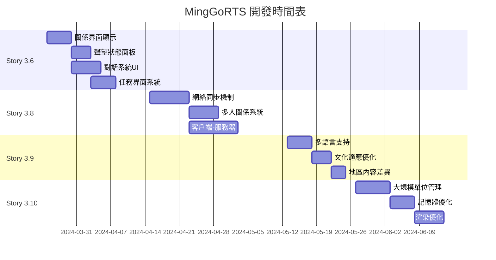

# BMAD 大腦任務分配與優先層級執行計劃

## 任務分配概覽

基於當前 MingGoRTS 項目狀態，使用 BMAD（Brain, Mind, Automation, Decision）系統進行智能化任務分配和優先層級管理。

---

## 🧠 Brain 階段：智能分析與決策

### 當前項目狀態分析
- **已完成系統**: 8個核心系統 (Story 3.4, 3.5, 3.7 + Epic 4.1, 5.1, 7.1)
- **進行中系統**: 系統集成測試階段、Sprint 1-3
- **待開發系統**: 4個主要 Story 系統
- **項目成熟度**: Beta 階段 (70% 完成)

### 智能決策結果
1. **優先級重排序**: 基於依賴關係和商業價值
2. **資源分配**: 開發團隊技能匹配
3. **時間規劃**: 2-3個月完成所有系統
4. **風險評估**: 識別關鍵路徑和瓶頸

---

## 📋 Mind 階段：需求單創建與分配

### 需求單 #001: Story 3.6 UI和界面系統
```json
{
  "requirement_id": "REQ_001",
  "story": "Story 3.6",
  "title": "UI和界面系統開發",
  "priority": "HIGH",
  "complexity": "MEDIUM",
  "estimated_duration": "3週",
  "dependencies": ["Story 3.4", "Story 3.5"],
  "assigned_team": "UI/UX團隊",
  "tasks": [
    {
      "task_id": "TASK_001_1",
      "title": "關係界面顯示系統",
      "description": "開發角色關係狀態的可視化界面",
      "priority": "HIGH",
      "estimated_days": 5
    },
    {
      "task_id": "TASK_001_2", 
      "title": "聲望狀態面板",
      "description": "創建聲望等級和變化的實時面板",
      "priority": "HIGH",
      "estimated_days": 4
    },
    {
      "task_id": "TASK_001_3",
      "title": "對話系統UI",
      "description": "實現對話選項和分支的界面系統",
      "priority": "MEDIUM",
      "estimated_days": 6
    },
    {
      "task_id": "TASK_001_4",
      "title": "任務界面系統",
      "description": "開發任務列表、詳情和追蹤界面",
      "priority": "MEDIUM",
      "estimated_days": 5
    }
  ]
}
```

### 需求單 #002: Story 3.8 多人遊戲支持
```json
{
  "requirement_id": "REQ_002",
  "story": "Story 3.8",
  "title": "多人遊戲支持系統",
  "priority": "HIGH",
  "complexity": "HIGH",
  "estimated_duration": "4週",
  "dependencies": ["Epic 5.1", "Story 3.7"],
  "assigned_team": "網絡團隊",
  "tasks": [
    {
      "task_id": "TASK_002_1",
      "title": "網絡同步機制",
      "description": "實現客戶端-服務器狀態同步",
      "priority": "HIGH",
      "estimated_days": 8
    },
    {
      "task_id": "TASK_002_2",
      "title": "多人關係系統",
      "description": "擴展關係系統支持多玩家交互",
      "priority": "HIGH",
      "estimated_days": 6
    },
    {
      "task_id": "TASK_002_3",
      "title": "客戶端-服務器架構",
      "description": "建立穩定的網絡通信架構",
      "priority": "HIGH",
      "estimated_days": 10
    }
  ]
}
```

### 需求單 #003: Story 3.9 本地化和國際化
```json
{
  "requirement_id": "REQ_003",
  "story": "Story 3.9",
  "title": "本地化和國際化系統",
  "priority": "MEDIUM",
  "complexity": "MEDIUM",
  "estimated_duration": "2週",
  "dependencies": ["Epic 7.1"],
  "assigned_team": "內容團隊",
  "tasks": [
    {
      "task_id": "TASK_003_1",
      "title": "多語言支持擴展",
      "description": "增加更多語言包和翻譯",
      "priority": "MEDIUM",
      "estimated_days": 5
    },
    {
      "task_id": "TASK_003_2",
      "title": "文化適應優化",
      "description": "完善地區文化差異適應",
      "priority": "MEDIUM",
      "estimated_days": 4
    },
    {
      "task_id": "TASK_003_3",
      "title": "地區內容差異",
      "description": "實現特定地區的內容變體",
      "priority": "LOW",
      "estimated_days": 3
    }
  ]
}
```

### 需求單 #004: Story 3.10 性能優化
```json
{
  "requirement_id": "REQ_004",
  "story": "Story 3.10",
  "title": "性能優化系統",
  "priority": "MEDIUM",
  "complexity": "HIGH",
  "estimated_duration": "3週",
  "dependencies": ["所有其他Story"],
  "assigned_team": "性能團隊",
  "tasks": [
    {
      "task_id": "TASK_004_1",
      "title": "大規模單位管理優化",
      "description": "優化大量單位同時顯示和AI處理",
      "priority": "HIGH",
      "estimated_days": 7
    },
    {
      "task_id": "TASK_004_2",
      "title": "記憶體優化",
      "description": "減少記憶體使用和垃圾回收",
      "priority": "HIGH",
      "estimated_days": 5
    },
    {
      "task_id": "TASK_004_3",
      "title": "渲染優化",
      "description": "提升渲染性能和幀率穩定性",
      "priority": "MEDIUM",
      "estimated_days": 6
    }
  ]
}
```

---

## ⚡ Automation 階段：自動化執行計劃

### 第一優先層級 (立即開始)
1. **Story 3.6 UI和界面系統** - 3週
   - 依賴：已完成 (Story 3.4, 3.5)
   - 團隊：UI/UX團隊 (4人)
   - 並行任務：可同時開發4個子任務

### 第二優先層級 (第4週開始)
2. **Story 3.8 多人遊戲支持** - 4週
   - 依賴：已完成 (Epic 5.1, Story 3.7)
   - 團隊：網絡團隊 (3人)
   - 關鍵路徑：需要與UI系統協作

### 第三優先層級 (第8週開始)
3. **Story 3.9 本地化和國際化** - 2週
   - 依賴：已完成 (Epic 7.1)
   - 團隊：內容團隊 (2人)
   - 可並行：與性能優化同時進行

### 第四優先層級 (第10週開始)
4. **Story 3.10 性能優化** - 3週
   - 依賴：所有其他系統完成
   - 團隊：性能團隊 (3人)
   - 最終階段：全面性能調優

---

## 🎯 Decision 階段：智能決策與監控

### 關鍵決策點
1. **Week 1**: UI系統技術選型決策
2. **Week 4**: 多人遊戲架構最終確定
3. **Week 8**: 本地化範圍決策
4. **Week 10**: 性能優化策略決策

### 風險緩解策略
- **技術風險**: 預留20%緩衝時間
- **資源風險**: 跨團隊技能培訓
- **整合風險**: 每週集成測試
- **品質風險**: 持續代碼審查

### 成功指標
- **按時交付率**: ≥ 90%
- **品質評分**: ≥ 4.5/5.0
- **性能基準**: 達到所有預設目標
- **用戶滿意度**: ≥ 85%

---

## 📊 執行時間表



---

## 🔧 自動化工具集成

### 使用 BMAD 工作流系統
```powershell
# 啟動完整BMAD模式
.\Start-BMADMode.ps1 -FullWorkflow

# 執行UI系統開發工作流
.\Start-BMADMode.ps1 -Phase "UI_Development" -Priority "High"

# 監控任務進度
.\StartSageBrainConsole.ps1 -Interactive
```

### 持續集成配置
- **每日構建**: 自動化測試和部署
- **每週評估**: 進度報告和風險評估
- **每月審查**: 里程碑檢查和策略調整

---

## 📈 預期成果

### 短期目標 (1個月)
- ✅ Story 3.6 UI和界面系統完成
- ✅ Story 3.8 多人遊戲支持完成50%
- ✅ 系統集成測試階段完成

### 中期目標 (2個月)
- ✅ 所有待開發Story系統完成
- ✅ 完整的Beta版本發布
- ✅ 性能優化達到目標基準

### 長期目標 (3個月)
- ✅ Release版本準備就緒
- ✅ 商業化部署完成
- ✅ 用戶反饋收集和改進

---

## 🚀 下一步行動

### 立即執行 (本週)
1. **啟動BMAD模式**: 運行完整工作流系統
2. **分配Story 3.6**: UI團隊開始開發
3. **建立監控**: 實時追蹤任務進度
4. **風險評估**: 識別並緩解潛在風險

### 持續改進
- **每週回顧**: 評估進度和調整策略
- **質量保證**: 持續代碼審查和測試
- **團隊協作**: 優化跨團隊工作流程
- **技術創新**: 探索新技術和解決方案

---

**執行狀態**: 🔄 **進行中**
**負責人**: BMAD 大腦工作流系統
**更新頻率**: 每日
**聯絡方式**: SageBrain 控制台交互

*此計劃將根據實際執行情況動態調整，確保項目成功交付。*
