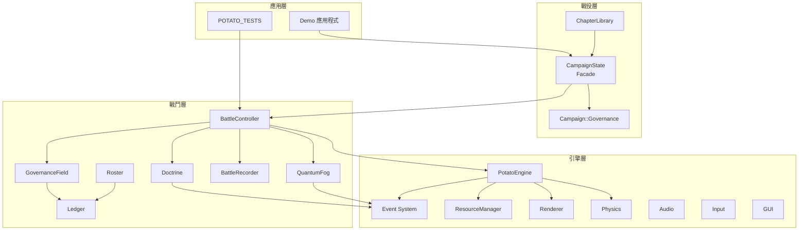
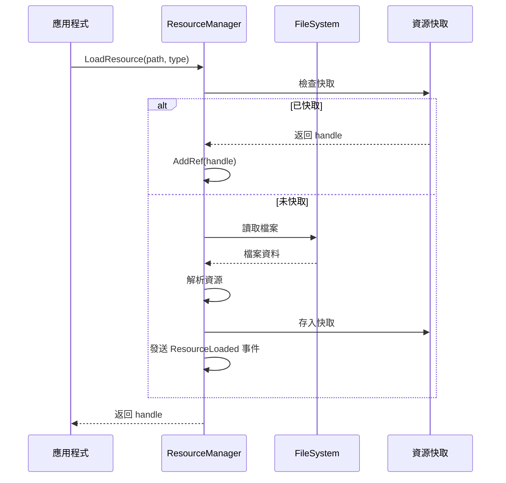
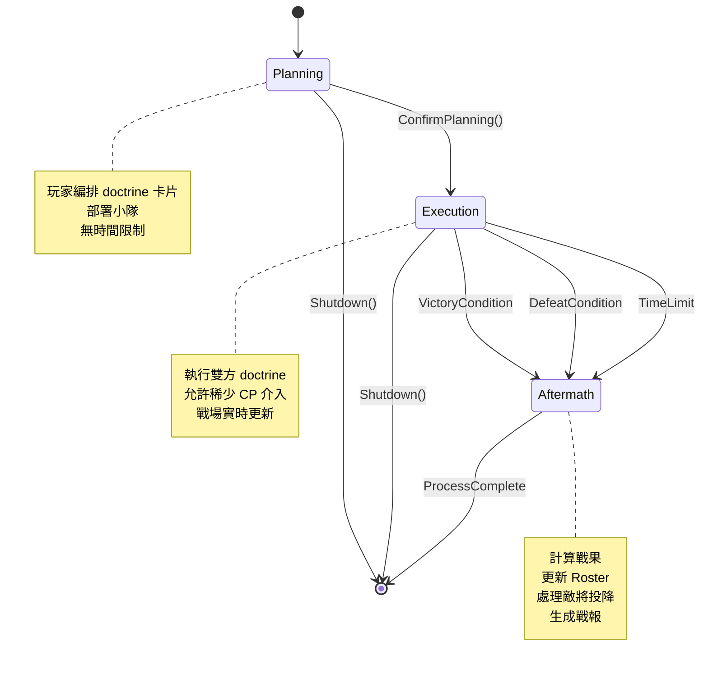
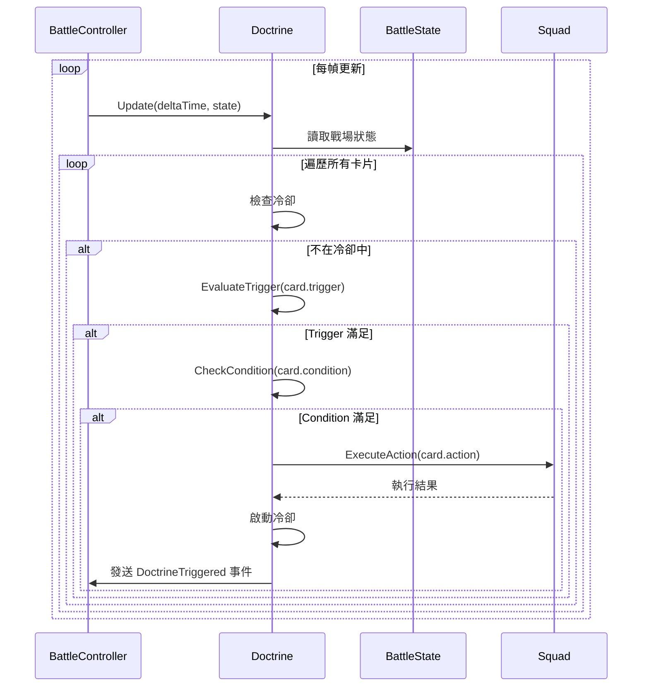
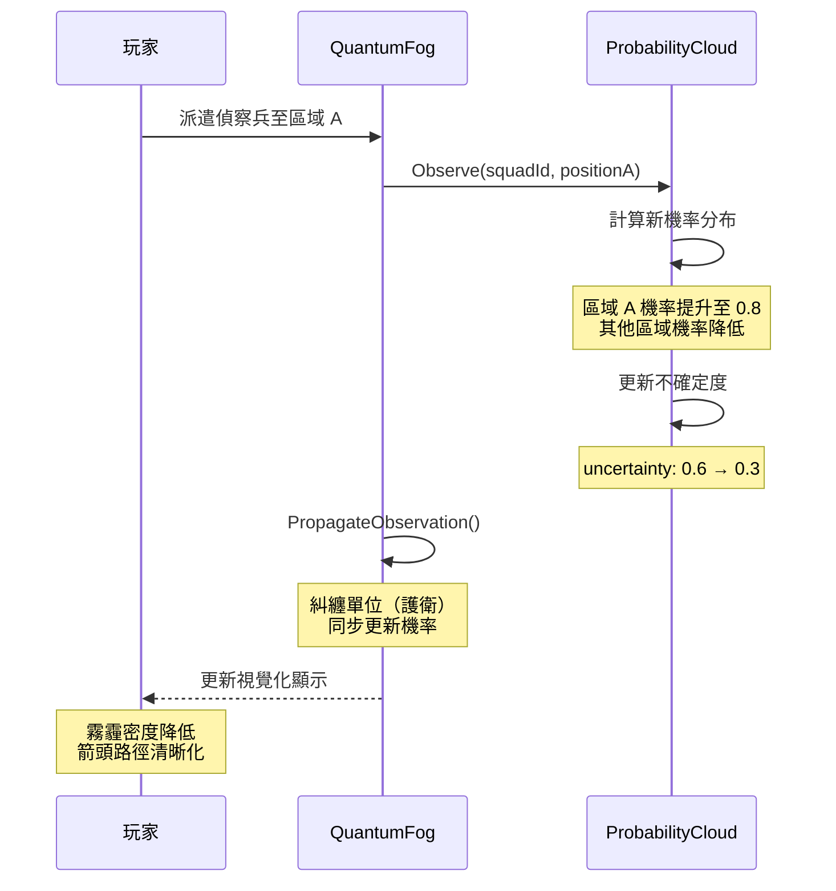
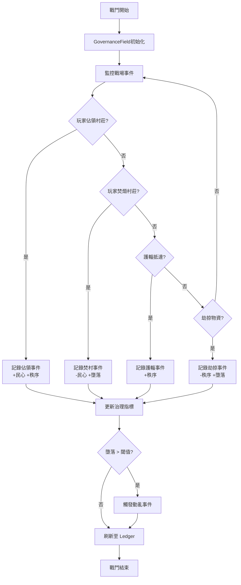
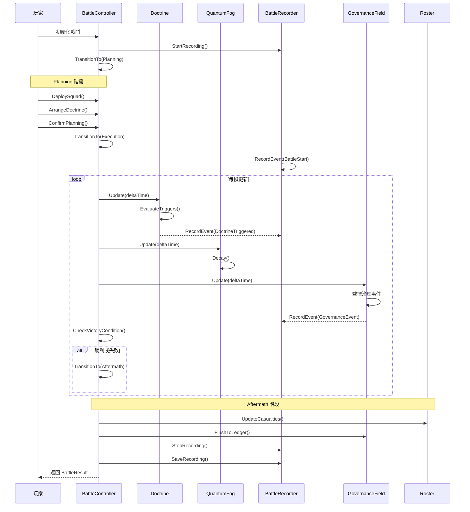
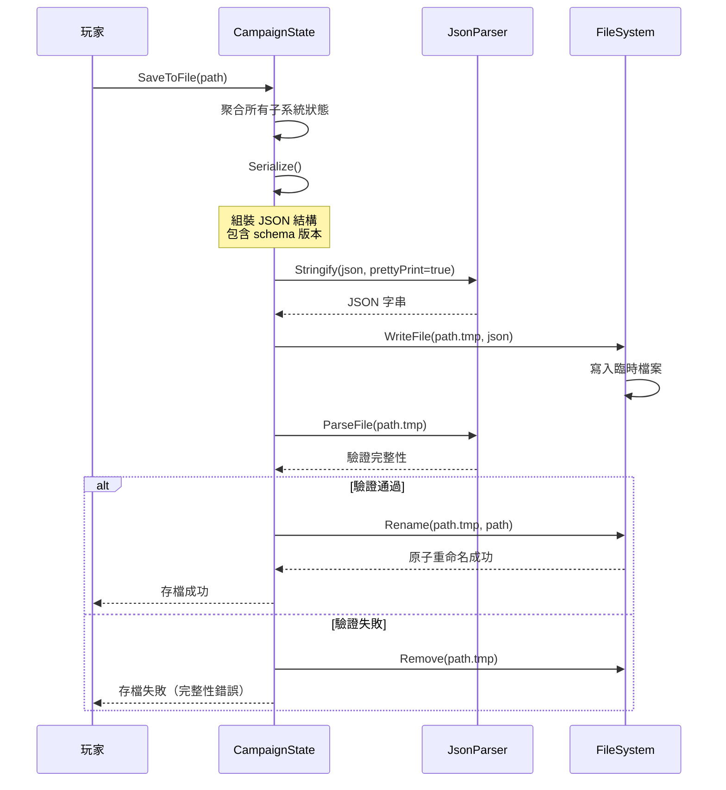
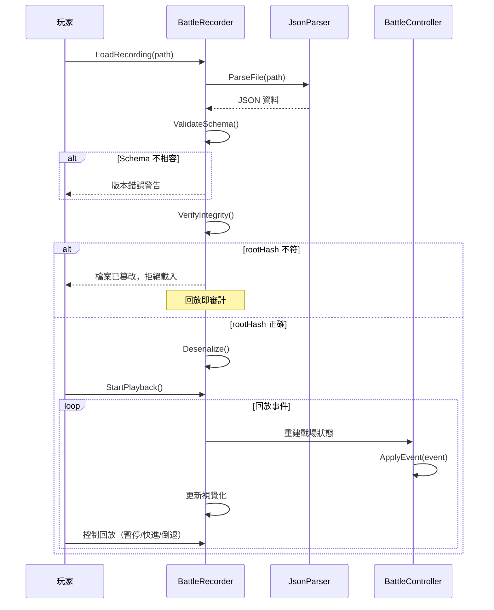
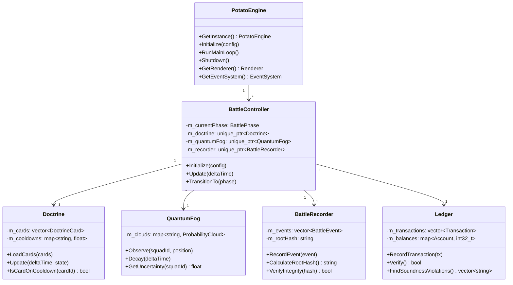

# MingGoRTS 技術設計文檔

## 文檔資訊

- **專案名稱：** MingGoRTS（民國史詩 RTS）
- **版本：** 1.0
- **建立日期：** 2026-09-XX
- **設計階段：** 詳細設計
- **目標讀者：** 架構師、開發工程師、技術主管

---

## Overview

### 專案簡介

MingGoRTS 是一款回合制 RPG 與即時戰略混合的戰術遊戲，執行於自研 PotatoEngine（C++20）。玩家透過編寫 doctrine 卡片（trigger → condition → action → modifier）來指揮戰鬥，體驗「至聖者無戰」與「治平者無勝」的雙重哲學。遊戲包含歷史層與神話層的雙層世界，融合戰術決策、治理系統與複式記帳機制。

### 設計目標

本設計文檔旨在：

1. 定義清晰的系統架構與模組邊界
2. 確保引擎與遊戲層的解耦與可測試性
3. 實現高效能的戰鬥模擬與資料持久化
4. 提供安全可靠的存檔與回放機制
5. 支援可擴展的 AI 系統與開發工具

### 技術棧

- **語言：** C++20
- **建置系統：** CMake ≥ 3.15
- **渲染：** OpenGL 3.3+
- **GUI：** Dear ImGui
- **窗口管理：** GLFW（FetchContent）
- **物理引擎：** Bullet Physics
- **音訊：** OpenAL Soft
- **序列化：** 自研 JsonParser（Potato::JsonValue）
- **測試：** CTest（85+ 測試檔案）

---

## Architecture

### 分層架構

MingGoRTS 採用嚴格的分層架構，依賴方向單向向下：

```
┌─────────────────────────────────────────────────────┐
│  Examples / Apps / Tests（外殼層）                    │
│  - Demo 應用程式                                      │
│  - 無頭測試（POTATO_TESTS）                          │
└─────────────────────────────────────────────────────┘
                        ↓ 依賴
┌─────────────────────────────────────────────────────┐
│  Campaign（戰役層）                                   │
│  - CampaignState（facade）                           │
│  - ChapterLibrary（章節定義）                        │
│  - Governance（民心/秩序/墮落累加器）                │
└─────────────────────────────────────────────────────┘
                        ↓ 依賴
┌─────────────────────────────────────────────────────┐
│  Gameplay（戰鬥層）                                   │
│  - BattleController（狀態機）                        │
│  - Doctrine（卡片解譯）                              │
│  - QuantumFog（機率雲霧）                            │
│  - Ledger（複式記帳）                                │
│  - Roster / RefitCamp（名冊整補）                    │
│  - BattleRecorder（錄製回放）                        │
└─────────────────────────────────────────────────────┘
                        ↓ 依賴
┌─────────────────────────────────────────────────────┐
│  PotatoEngine（引擎層）                               │
│  - Core（引擎核心）                                   │
│  - Rendering（渲染系統）                             │
│  - Physics（物理系統）                               │
│  - Audio（音訊系統）                                 │
│  - Input（輸入系統）                                 │
│  - GUI（ImGui 封裝）                                 │
│  - Events（事件系統）                                │
│  - Resources（資源管理）                             │
│  - Serialization（序列化）                           │
│  - AI（AI Agent 框架）                               │
└─────────────────────────────────────────────────────┘
```

**架構原則：**

1. **單向依賴：** 上層可依賴下層，下層禁止依賴上層
2. **Headless 可測：** Gameplay 層完全無 OpenGL context 需求
3. **Facade 隔離：** 戰役層透過 CampaignState facade 聚合狀態
4. **事件解耦：** 跨層通訊優先使用事件系統，避免直接耦合

### 系統組件圖



### 執行緒模型

**主執行緒架構（單執行緒為主）：**

```
Main Thread:
  PotatoEngine::RunMainLoop()
    ├─ Input::Update()          // 輸入處理
    ├─ EventSystem::Process()   // 事件派發
    ├─ BattleController::Update() // 戰鬥邏輯
    │   ├─ Doctrine::Evaluate()
    │   ├─ QuantumFog::Update()
    │   └─ Squad::Update()
    ├─ Renderer::Render()       // 渲染
    └─ Audio::Update()          // 音訊更新
```

**異步操作（Worker Threads）：**

- **資源載入：** ResourceManager 使用 std::async 異步載入資源
- **AI 計算：** AIAgentSystem 支援多執行緒 Agent 執行
- **序列化：** 存檔寫入使用 tmp + rename 原子操作（單執行緒）

**執行緒同步：**

- 使用 `std::mutex` 保護共享資料
- 事件佇列使用 lock-free queue（待實作）或 mutex 保護
- 避免跨執行緒直接存取遊戲狀態

---

## Components and Interfaces

### PotatoEngine（引擎核心）

#### 類別定義

```cpp
// Core/PotatoEngine.h
namespace Potato {

class PotatoEngine {
public:
    // 單例模式
    static PotatoEngine& GetInstance();
    
    // 生命週期
    void Initialize(const EngineConfig& config);
    void RunMainLoop();
    void Shutdown();
    
    // 子系統存取
    Rendering::Renderer& GetRenderer();
    Physics::PhysicsWorld& GetPhysics();
    Audio::AudioEngine& GetAudio();
    Input::InputManager& GetInput();
    GUI::GUISystem& GetGUI();
    Resources::ResourceManager& GetResourceManager();
    AI::AIAgentSystem& GetAISystem();
    Events::EventSystem& GetEventSystem();
    
    // 時間控制
    void SetTimeScale(float scale);
    float GetTimeScale() const;
    void Pause();
    void Resume();
    bool IsPaused() const;
    
    // 性能監控
    const PerformanceMetrics& GetMetrics() const;
    
private:
    PotatoEngine() = default;
    ~PotatoEngine() = default;
    PotatoEngine(const PotatoEngine&) = delete;
    PotatoEngine& operator=(const PotatoEngine&) = delete;
    
    void UpdateSubsystems(float deltaTime);
    
    std::unique_ptr<Rendering::Renderer> m_renderer;
    std::unique_ptr<Physics::PhysicsWorld> m_physics;
    std::unique_ptr<Audio::AudioEngine> m_audio;
    std::unique_ptr<Input::InputManager> m_input;
    std::unique_ptr<GUI::GUISystem> m_gui;
    std::unique_ptr<Resources::ResourceManager> m_resourceManager;
    std::unique_ptr<AI::AIAgentSystem> m_aiSystem;
    std::unique_ptr<Events::EventSystem> m_eventSystem;
    
    float m_timeScale = 1.0f;
    bool m_paused = false;
    PerformanceMetrics m_metrics;
};

struct EngineConfig {
    uint32_t windowWidth = 1920;
    uint32_t windowHeight = 1080;
    bool fullscreen = false;
    bool vsync = true;
    std::string windowTitle = "MingGoRTS";
    std::string assetPath = "assets/";
};

struct PerformanceMetrics {
    float fps = 0.0f;
    float frameTime = 0.0f;
    size_t memoryUsageMB = 0;
    uint32_t drawCalls = 0;
    uint32_t triangles = 0;
};

} // namespace Potato
```

#### 主循環實作

```cpp
// Core/PotatoEngine.cpp
void PotatoEngine::RunMainLoop() {
    using Clock = std::chrono::high_resolution_clock;
    auto lastFrameTime = Clock::now();
    
    while (!glfwWindowShouldClose(m_window)) {
        auto currentTime = Clock::now();
        float deltaTime = std::chrono::duration<float>(
            currentTime - lastFrameTime).count();
        lastFrameTime = currentTime;
        
        // 應用時間縮放
        if (!m_paused) {
            float scaledDelta = deltaTime * m_timeScale;
            UpdateSubsystems(scaledDelta);
        }
        
        // 更新性能指標
        m_metrics.fps = 1.0f / deltaTime;
        m_metrics.frameTime = deltaTime * 1000.0f; // ms
        
        // 渲染
        m_renderer->BeginFrame();
        m_renderer->Render();
        m_gui->Render();
        m_renderer->EndFrame();
        m_renderer->Present();
        
        glfwPollEvents();
    }
}

void PotatoEngine::UpdateSubsystems(float deltaTime) {
    m_input->Update();
    m_eventSystem->ProcessEvents();
    m_aiSystem->Update(deltaTime);
    m_physics->Step(deltaTime);
    m_audio->Update(deltaTime);
    
    // 發送幀更新事件
    m_eventSystem->EmitEvent(Events::Event{
        .type = Events::EventType::FrameUpdate,
        .timestamp = Clock::now(),
        .data = deltaTime
    });
}
```

### Event System（事件系統）

#### 類別定義

```cpp
// Events/EventSystem.h
namespace Potato::Events {

enum class EventType {
    // 引擎事件
    FrameUpdate,
    ResourceLoaded,
    ResourceUnloaded,
    SceneChanged,
    InputReceived,
    
    // 戰鬥事件
    BattleStateChanged,
    DoctrineTriggered,
    SquadMoved,
    SquadAttacked,
    SquadDestroyed,
    
    // 治理事件
    VillageCaptured,
    VillageBurned,
    SupplyDelivered,
    SupplyLooted,
    
    // 神話事件
    MythEventTriggered,
    ShrineAppeased,
    DeityAngered,
    
    // 自定義事件
    Custom
};

struct Event {
    EventType type;
    std::chrono::system_clock::time_point timestamp;
    std::any data; // 事件負載（限制 1KB）
    uint32_t priority = 0; // 0 = 正常，越高越優先
};

using EventCallback = std::function<void(const Event&)>;

class EventSystem {
public:
    void RegisterEvent(EventType type, EventCallback callback);
    void UnregisterEvent(EventType type, const EventCallback& callback);
    void EmitEvent(Event&& event);
    void ProcessEvents(); // 每幀調用，處理事件佇列
    
    // 性能監控
    struct Stats {
        uint32_t eventsProcessed = 0;
        float avgProcessTime = 0.0f;
    };
    const Stats& GetStats() const { return m_stats; }
    
private:
    using CallbackList = std::vector<EventCallback>;
    std::unordered_map<EventType, CallbackList> m_subscribers;
    
    // 優先級佇列
    struct EventComparator {
        bool operator()(const Event& a, const Event& b) const {
            return a.priority < b.priority;
        }
    };
    std::priority_queue<Event, std::vector<Event>, EventComparator> m_eventQueue;
    std::mutex m_queueMutex;
    
    Stats m_stats;
};

} // namespace Potato::Events
```

#### 事件使用範例

```cpp
// 訂閱事件
auto& eventSys = PotatoEngine::GetInstance().GetEventSystem();
eventSys.RegisterEvent(EventType::SquadDestroyed, 
    [](const Event& e) {
        auto squadId = std::any_cast<uint32_t>(e.data);
        Log::Info("Squad {} destroyed", squadId);
    });

// 發送事件
eventSys.EmitEvent(Event{
    .type = EventType::SquadDestroyed,
    .timestamp = std::chrono::system_clock::now(),
    .data = squadId,
    .priority = 10 // 高優先級
});
```

### Resource Manager（資源管理）

#### 類別定義

```cpp
// Resources/ResourceManager.h
namespace Potato::Resources {

using ResourceHandle = uint64_t;

enum class ResourceType {
    Texture,
    Model,
    Sound,
    Music,
    Script,
    Scene,
    Custom
};

struct Resource {
    ResourceHandle handle;
    ResourceType type;
    std::string path;
    std::shared_ptr<void> data; // 實際資源資料
    size_t refCount = 0;
    bool isLoaded = false;
};

class ResourceManager {
public:
    // 同步載入
    ResourceHandle LoadResource(const std::string& path, ResourceType type);
    
    // 異步載入
    std::future<ResourceHandle> LoadResourceAsync(
        const std::string& path, ResourceType type);
    
    // 資源查詢
    bool IsResourceLoaded(ResourceHandle handle) const;
    std::shared_ptr<void> GetResourceData(ResourceHandle handle);
    
    // 資源釋放
    void UnloadResource(ResourceHandle handle);
    void ClearResourceCache();
    
    // 熱重載
    void EnableHotReload(bool enable);
    void ReloadResource(ResourceHandle handle);
    
    // 引用計數
    void AddRef(ResourceHandle handle);
    void Release(ResourceHandle handle);
    
private:
    std::unordered_map<ResourceHandle, Resource> m_resources;
    std::unordered_map<std::string, ResourceHandle> m_pathToHandle;
    mutable std::shared_mutex m_resourceMutex;
    
    ResourceHandle GenerateHandle();
    void LoadResourceInternal(Resource& res);
};

} // namespace Potato::Resources
```

#### 資源載入流程



### Serialization System（序列化系統）

#### JSON Schema 設計

**Schema 版本化規範：**

所有 JSON 檔案必須包含 `$schema` 欄位，格式為 `potato.<name>/<version>`。

```json
{
  "$schema": "potato.battle_recording/1",
  "battleId": "...",
  "events": [...]
}
```

**內建 Schema 列表：**

| Schema 名稱 | 版本 | 說明 |
|------------|------|------|
| `potato.campaign/1` | 1 | 戰役存檔 |
| `potato.battle_recording/1` | 1 | 戰鬥錄製 |
| `potato.ledger_chain/1` | 1 | 複式記帳鏈 |
| `potato.campaign_ledger/1` | 1 | 戰役帳本 |
| `potato.myth_log/1` | 1 | 神話事件記錄 |
| `potato.scene/1` | 1 | 場景定義 |
| `potato.map/1` | 1 | 地圖資料 |

#### JsonParser 實作

```cpp
// Serialization/JsonParser.h
namespace Potato {

class JsonValue {
public:
    enum class Type {
        Null, Bool, Number, String, Array, Object
    };
    
    JsonValue() : m_type(Type::Null) {}
    explicit JsonValue(bool b);
    explicit JsonValue(double n);
    explicit JsonValue(const std::string& s);
    explicit JsonValue(std::vector<JsonValue> arr);
    explicit JsonValue(std::unordered_map<std::string, JsonValue> obj);
    
    Type GetType() const { return m_type; }
    bool IsNull() const { return m_type == Type::Null; }
    bool IsBool() const { return m_type == Type::Bool; }
    bool IsNumber() const { return m_type == Type::Number; }
    bool IsString() const { return m_type == Type::String; }
    bool IsArray() const { return m_type == Type::Array; }
    bool IsObject() const { return m_type == Type::Object; }
    
    bool AsBool() const;
    double AsNumber() const;
    const std::string& AsString() const;
    const std::vector<JsonValue>& AsArray() const;
    const std::unordered_map<std::string, JsonValue>& AsObject() const;
    
    // Object 操作
    bool HasKey(const std::string& key) const;
    const JsonValue& operator[](const std::string& key) const;
    JsonValue& operator[](const std::string& key);
    
    // Array 操作
    size_t Size() const;
    const JsonValue& operator[](size_t index) const;
    
private:
    Type m_type;
    std::variant<std::monostate, bool, double, std::string,
                 std::vector<JsonValue>,
                 std::unordered_map<std::string, JsonValue>> m_data;
};

class JsonParser {
public:
    static JsonValue Parse(const std::string& jsonStr);
    static JsonValue ParseFile(const std::string& path);
    static std::string Stringify(const JsonValue& value, bool prettyPrint = false);
    static bool WriteFile(const std::string& path, const JsonValue& value);
    
    // Schema 驗證
    static bool ValidateSchema(const JsonValue& value, const std::string& expectedSchema);
    static std::string GetSchema(const JsonValue& value);
    
private:
    static JsonValue ParseValue(const char*& ptr);
    static void SkipWhitespace(const char*& ptr);
};

} // namespace Potato
```

#### 原子寫入實作

```cpp
// Serialization/AtomicWrite.cpp
bool JsonParser::WriteFile(const std::string& path, const JsonValue& value) {
    // tmp + rename 原子寫入
    std::string tmpPath = path + ".tmp";
    
    // 1. 寫入臨時檔案
    std::ofstream ofs(tmpPath);
    if (!ofs.is_open()) {
        Log::Error("Failed to open tmp file: {}", tmpPath);
        return false;
    }
    
    std::string jsonStr = Stringify(value, true);
    ofs << jsonStr;
    ofs.close();
    
    // 2. 驗證臨時檔案完整性
    JsonValue verified = ParseFile(tmpPath);
    if (verified.IsNull()) {
        Log::Error("Tmp file verification failed: {}", tmpPath);
        std::filesystem::remove(tmpPath);
        return false;
    }
    
    // 3. 原子重命名
    std::error_code ec;
    std::filesystem::rename(tmpPath, path, ec);
    if (ec) {
        Log::Error("Atomic rename failed: {} -> {}", tmpPath, path);
        return false;
    }
    
    Log::Info("File written atomically: {}", path);
    return true;
}
```

---

## Data Models

### BattleController（戰鬥控制器）

#### 狀態機設計

```cpp
// Gameplay/BattleController.h
namespace MingGoRTS {

enum class BattlePhase {
    Planning,   // 規劃階段
    Execution,  // 執行階段
    Aftermath   // 結算階段
};

class BattleController {
public:
    BattleController();
    
    // 生命週期
    void Initialize(const BattleConfig& config);
    void Update(float deltaTime);
    void Shutdown();
    
    // 狀態轉換
    void TransitionTo(BattlePhase newPhase);
    BattlePhase GetCurrentPhase() const { return m_currentPhase; }
    
    // Planning 階段
    void DeploySquad(const std::string& squadName, const glm::vec2& position);
    void ArrangeDoctrine(const std::vector<DoctrineCard>& cards);
    void ConfirmPlanning();
    
    // Execution 階段
    void UseCommandPoint(const CommandAction& action); // CP 介入
    bool CanUseCommandPoint() const;
    
    // Aftermath 階段
    const BattleResult& GetBattleResult() const;
    void ProcessSurrender(const std::string& generalName);
    
    // 子系統存取
    Doctrine& GetDoctrine() { return *m_doctrine; }
    QuantumFog& GetQuantumFog() { return *m_quantumFog; }
    BattleRecorder& GetRecorder() { return *m_recorder; }
    Roster& GetRoster() { return *m_roster; }
    GovernanceField& GetGovernanceField() { return *m_governanceField; }
    
private:
    void UpdatePlanning(float deltaTime);
    void UpdateExecution(float deltaTime);
    void UpdateAftermath(float deltaTime);
    
    void OnEnterPlanning();
    void OnExitPlanning();
    void OnEnterExecution();
    void OnExitExecution();
    void OnEnterAftermath();
    void OnExitAftermath();
    
    bool CheckVictoryCondition();
    bool CheckDefeatCondition();
    bool CheckTimeLimit();
    
    BattlePhase m_currentPhase = BattlePhase::Planning;
    std::chrono::system_clock::time_point m_phaseStartTime;
    
    std::unique_ptr<Doctrine> m_doctrine;
    std::unique_ptr<QuantumFog> m_quantumFog;
    std::unique_ptr<BattleRecorder> m_recorder;
    std::unique_ptr<Roster> m_roster;
    std::unique_ptr<GovernanceField> m_governanceField;
    
    uint32_t m_commandPoints = 3; // 稀少的指揮點
    BattleResult m_result;
};

struct BattleConfig {
    std::string battleId;
    std::string mapPath;
    std::vector<std::string> playerSquads;
    std::vector<std::string> enemySquads;
    float timeLimit = 600.0f; // 10 分鐘
};

struct BattleResult {
    bool victory = false;
    uint32_t casualtiesPlayer = 0;
    uint32_t casualtiesEnemy = 0;
    std::vector<std::string> capturedGenerals;
    std::unordered_map<std::string, int32_t> ledgerDelta; // 武功/民心變化
};

} // namespace MingGoRTS
```

#### 狀態機流程圖



### Doctrine（卡片系統）

#### 卡片結構設計

```cpp
// Gameplay/Doctrine.h
namespace MingGoRTS {

// Trigger 類型（20+ 種）
enum class TriggerType {
    EnemyInRange,           // 敵人進入範圍
    HealthBelowThreshold,   // 生命值低於閾值
    TimeElapsed,            // 時間經過
    AllyInDanger,           // 友軍危險
    TerrainAdvantage,       // 地形優勢
    EnemyRetreat,           // 敵人撤退
    SupplyLow,              // 補給不足
    // ... 更多
};

// Condition 類型（15+ 種）
enum class ConditionType {
    EnemyCountGreaterThan,  // 敵人數量大於
    TerrainType,            // 地形類型
    AllyDistanceLessThan,   // 友軍距離小於
    TimeOfDay,              // 時段
    WeatherCondition,       // 天氣條件
    MoraleAbove,            // 士氣高於
    // ... 更多
};

// Action 類型（25+ 種）
enum class ActionType {
    Attack,                 // 進攻
    Retreat,                // 撤退
    Flank,                  // 包抄
    Defend,                 // 防守
    Support,                // 支援
    Ambush,                 // 埋伏
    Charge,                 // 衝鋒
    HoldPosition,           // 堅守陣地
    // ... 更多
};

// Modifier 類型
enum class ModifierType {
    Speed,                  // 速度修正
    Range,                  // 範圍修正
    Priority,               // 優先級修正
    Duration,               // 持續時間
};

struct Trigger {
    TriggerType type;
    std::unordered_map<std::string, float> parameters;
    // 例如：{"range": 10.0, "threshold": 0.3}
};

struct Condition {
    ConditionType type;
    std::unordered_map<std::string, float> parameters;
    // 例如：{"minCount": 3, "terrainType": 2}
};

struct Action {
    ActionType type;
    std::string targetSquadId; // 目標小隊（可選）
    std::unordered_map<std::string, float> parameters;
};

struct Modifier {
    ModifierType type;
    float value;
};

struct DoctrineCard {
    std::string cardId;
    std::string displayName;
    Trigger trigger;
    Condition condition;
    Action action;
    std::vector<Modifier> modifiers;
    float cooldown = 30.0f; // 冷卻時間（秒）
};

class Doctrine {
public:
    void LoadCards(const std::vector<DoctrineCard>& cards);
    void Update(float deltaTime, const BattleState& state);
    
    // 卡片評估
    void EvaluateTriggers(const BattleState& state);
    bool CheckCondition(const Condition& cond, const BattleState& state);
    void ExecuteAction(const Action& act, const BattleState& state);
    
    // 冷卻管理
    bool IsCardOnCooldown(const std::string& cardId) const;
    float GetRemainingCooldown(const std::string& cardId) const;
    
private:
    std::vector<DoctrineCard> m_cards;
    std::unordered_map<std::string, float> m_cooldowns; // cardId -> 剩餘冷卻
};

} // namespace MingGoRTS
```

#### 卡片執行流程



### QuantumFog（量子霧霾）

#### 機率雲霧設計

```cpp
// Gameplay/QuantumFog.h
namespace MingGoRTS {

// 量子態：單位的可能位置與狀態
struct QuantumState {
    glm::vec2 position;
    float probability;      // 該位置的機率
    SquadState state;       // 單位狀態（健康/受傷/陣亡）
};

// 機率雲霧：某單位的所有可能狀態
struct ProbabilityCloud {
    std::string squadId;
    std::vector<QuantumState> possibleStates;
    float uncertainty;      // 總不確定度（0=完全確定，1=完全不確定）
    std::chrono::system_clock::time_point lastObserved;
};

class QuantumFog {
public:
    // 初始化與更新
    void Initialize(const std::vector<std::string>& enemySquadIds);
    void Update(float deltaTime);
    
    // 疊加態管理
    void SetSuperposition(const std::string& squadId, 
                          const std::vector<QuantumState>& states);
    const ProbabilityCloud& GetCloud(const std::string& squadId) const;
    
    // 觀測與衰減
    void Observe(const std::string& squadId, const glm::vec2& position);
    void Decay(float deltaTime); // 時間衰減，增加不確定性
    
    // 糾纏機制
    void EntangleSquads(const std::string& squadA, const std::string& squadB);
    void PropagateObservation(const std::string& observedSquad);
    
    // 人格先驗
    void SetPersonalityPrior(const std::string& generalName, 
                             const PersonalityTraits& traits);
    void ApplyPrior(const std::string& squadId);
    
    // 查詢
    float GetUncertainty(const std::string& squadId) const;
    std::vector<glm::vec2> GetLikelyPositions(const std::string& squadId, 
                                               float minProbability = 0.1f) const;
    
private:
    std::unordered_map<std::string, ProbabilityCloud> m_clouds;
    std::unordered_map<std::string, std::vector<std::string>> m_entanglements;
    std::unordered_map<std::string, PersonalityTraits> m_priors;
    
    float m_decayRate = 0.05f; // 每秒不確定度增加率
};

struct PersonalityTraits {
    float aggression;       // 進攻傾向（0-1）
    float caution;          // 謹慎度（0-1）
    float mobility;         // 機動性（0-1）
};

} // namespace MingGoRTS
```

#### 觀測流程



### BattleRecorder（戰鬥錄製）

#### 錄製格式設計

```cpp
// Gameplay/BattleRecorder.h
namespace MingGoRTS {

enum class EventType {
    BattleStart,
    BattleEnd,
    SquadDeployed,
    SquadMoved,
    SquadAttacked,
    SquadDestroyed,
    DoctrineTriggered,
    CommandPointUsed,
    GovernanceEvent,
    MythEvent
};

struct BattleEvent {
    EventType type;
    std::chrono::milliseconds timestamp; // 相對於戰鬥開始
    std::string actorId;    // 觸發者 ID
    std::string targetId;   // 目標 ID（可選）
    Potato::JsonValue data; // 事件資料
};

class BattleRecorder {
public:
    // 錄製控制
    void StartRecording(const std::string& battleId);
    void StopRecording();
    void RecordEvent(BattleEvent&& event);
    
    // 完整性驗證
    std::string CalculateRootHash() const;
    bool VerifyIntegrity(const std::string& expectedHash) const;
    
    // 序列化
    bool SaveRecording(const std::string& path);
    bool LoadRecording(const std::string& path);
    
    // 回放控制
    void StartPlayback();
    void PausePlayback();
    void SeekTo(std::chrono::milliseconds time);
    void SetPlaybackSpeed(float speed);
    
    // 視角切換
    enum class ViewMode {
        Player,     // 玩家視角
        Enemy,      // 敵方視角
        Omniscient  // 全知視角
    };
    void SetViewMode(ViewMode mode);
    
    const std::vector<BattleEvent>& GetEvents() const { return m_events; }
    
private:
    std::string m_battleId;
    std::vector<BattleEvent> m_events;
    std::chrono::system_clock::time_point m_startTime;
    bool m_recording = false;
    
    std::string m_rootHash; // FNV-1a 雜湊
    
    // 回放狀態
    bool m_playing = false;
    size_t m_playbackIndex = 0;
    float m_playbackSpeed = 1.0f;
};

} // namespace MingGoRTS
```

#### JSON Schema（potato.battle_recording/1）

```json
{
  "$schema": "potato.battle_recording/1",
  "battleId": "duanqiao-001",
  "startTime": "2026-09-15T14:30:00Z",
  "duration": 450.5,
  "rootHash": "a3f5d8c9...",
  "events": [
    {
      "type": "BattleStart",
      "timestamp": 0,
      "data": {
        "mapId": "duanqiao",
        "playerSquads": ["1st_regiment", "cavalry_a"],
        "enemySquads": ["enemy_infantry", "enemy_artillery"]
      }
    },
    {
      "type": "SquadMoved",
      "timestamp": 1500,
      "actorId": "1st_regiment",
      "data": {
        "from": {"x": 100, "y": 200},
        "to": {"x": 150, "y": 220},
        "path": [[100, 200], [120, 210], [150, 220]]
      }
    },
    {
      "type": "DoctrineTriggered",
      "timestamp": 3200,
      "actorId": "1st_regiment",
      "data": {
        "cardId": "ambush_on_sight",
        "triggerReason": "EnemyInRange",
        "targetId": "enemy_infantry"
      }
    }
  ]
}
```

### Ledger（複式記帳）

#### 五帳戶設計

```cpp
// Gameplay/Ledger.h
namespace MingGoRTS {

enum class Account {
    MartialMerit,   // 武功
    PopularSupport, // 民心
    Mandate,        // 天命
    MilitaryPrestige, // 軍威
    Supplies        // 物資
};

struct Transaction {
    std::string txId;
    std::chrono::system_clock::time_point timestamp;
    std::string description;
    
    // 借方
    std::unordered_map<Account, int32_t> debits;
    
    // 貸方
    std::unordered_map<Account, int32_t> credits;
    
    // 完整性
    std::string prevHash;   // 前一筆交易的雜湊
    std::string currentHash; // 本筆交易的雜湊（FNV-1a）
    
    // 疑帳標記
    bool suspect = false;
};

class Ledger {
public:
    // 記帳操作
    void RecordTransaction(Transaction&& tx);
    bool DebitCredit(Account debit, Account credit, int32_t amount, 
                     const std::string& desc);
    
    // 查詢
    int32_t GetBalance(Account account) const;
    const std::vector<Transaction>& GetTransactions() const { return m_transactions; }
    
    // 完整性驗證
    bool Verify() const; // 檢測雜湊鏈斷鏈
    std::vector<std::string> FindSoundnessViolations() const; // 借貸不等
    
    // 偽帳機制（對手注入）
    void InjectForgery(Transaction&& fakeTx);
    void MarkSuspect(const std::string& txId);
    
    // 序列化
    Potato::JsonValue Serialize() const;
    bool Deserialize(const Potato::JsonValue& json);
    
private:
    std::vector<Transaction> m_transactions;
    std::unordered_map<Account, int32_t> m_balances;
    
    std::string CalculateHash(const Transaction& tx) const;
    bool ValidateTransaction(const Transaction& tx) const;
};

class LedgerChain {
public:
    LedgerChain() = default;
    
    void Append(Transaction&& tx);
    const Ledger& GetLedger() const { return m_ledger; }
    
private:
    Ledger m_ledger;
};

} // namespace MingGoRTS
```

#### 借貸平衡範例

```cpp
// 範例：玩家攻下村莊
// 借：武功 +10、民心 +5
// 貸：天命 -15（神話層消耗）

Transaction tx{
    .txId = GenerateId(),
    .timestamp = Clock::now(),
    .description = "攻佔村莊：斷橋鎮",
    .debits = {
        {Account::MartialMerit, 10},
        {Account::PopularSupport, 5}
    },
    .credits = {
        {Account::Mandate, 15}
    }
};

// 驗證借貸平衡
int32_t debitSum = 10 + 5 = 15;
int32_t creditSum = 15;
assert(debitSum == creditSum); // 必須相等

ledger.RecordTransaction(std::move(tx));
```

### GovernanceField（治理系統）

#### 治理事件設計

```cpp
// Gameplay/GovernanceField.h
namespace MingGoRTS {

enum class GovernanceEventType {
    VillageCaptured,    // 村莊佔領
    VillageBurned,      // 村莊焚毀
    SupplyDelivered,    // 物資送達
    SupplyLooted,       // 物資劫掠
    ShrineAppeased,     // 神社安撫
    CivilianRescued,    // 平民救援
    AtrocityCommitted   // 暴行
};

struct GovernanceEvent {
    GovernanceEventType type;
    std::string locationId;
    int32_t popularSupportDelta = 0;
    int32_t orderDelta = 0;
    int32_t corruptionDelta = 0;
    std::string description;
};

class GovernanceField {
public:
    void Initialize(const std::string& mapId);
    void Update(float deltaTime);
    
    // 事件記錄
    void RecordEvent(GovernanceEvent&& event);
    const std::vector<GovernanceEvent>& GetEvents() const { return m_events; }
    
    // 治理指標
    int32_t GetPopularSupport() const { return m_popularSupport; }
    int32_t GetOrder() const { return m_order; }
    int32_t GetCorruption() const { return m_corruption; }
    
    // Ratchet 機制：墮落只增不減
    void IncreaseCorruption(int32_t amount);
    
    // 動亂檢測
    bool CheckUnrestThreshold() const;
    
    // 整合 Ledger
    void FlushToLedger(Ledger& ledger);
    
private:
    std::string m_mapId;
    std::vector<GovernanceEvent> m_events;
    
    int32_t m_popularSupport = 0;
    int32_t m_order = 0;
    int32_t m_corruption = 0; // Ratchet：只增不減
    
    const int32_t UNREST_THRESHOLD = 50;
};

} // namespace MingGoRTS
```

#### 治理流程圖



---

### CampaignState（戰役狀態 Facade）

#### Facade 模式設計

```cpp
// Campaign/CampaignState.h
namespace MingGoRTS::Campaign {

class CampaignState {
public:
    CampaignState();
    
    // 生命週期
    void Initialize(const std::string& campaignId);
    bool LoadFromFile(const std::string& savePath);
    bool SaveToFile(const std::string& savePath);
    
    // 子系統存取
    Roster& GetRoster() { return m_roster; }
    Governance& GetGovernance() { return m_governance; }
    CampaignLedger& GetLedger() { return m_ledger; }
    ChapterState& GetChapterState() { return m_chapterState; }
    
    // 戰役進度
    void CompleteChapter(const std::string& chapterId);
    bool IsChapterUnlocked(const std::string& chapterId) const;
    const std::vector<std::string>& GetCompletedChapters() const;
    
    // 敵將處置
    void RecordGeneralDisposition(const std::string& generalName, 
                                   GeneralDisposition disposition);
    GeneralDisposition GetGeneralDisposition(const std::string& generalName) const;
    
    // 稱號系統
    void AwardTitle(const std::string& title);
    const std::vector<std::string>& GetTitles() const;
    
    // 結局判定
    EndingType DetermineEnding() const;
    
private:
    std::string m_campaignId;
    
    // 聚合子存儲
    Roster m_roster;
    Governance m_governance;
    CampaignLedger m_ledger;
    ChapterState m_chapterState;
    
    std::vector<std::string> m_completedChapters;
    std::unordered_map<std::string, GeneralDisposition> m_generalDispositions;
    std::vector<std::string> m_titles;
};

enum class GeneralDisposition {
    None,           // 尚未處置
    Executed,       // 斬首
    Imprisoned,     // 俘虜
    Released,       // 釋放
    Recruited       // 招降
};

enum class EndingType {
    MilitaryVictory,    // 軍事勝利
    PeacefulUnification, // 和平統一
    GovernanceTriumph,  // 治理勝利
    Tyranny,            // 暴政結局
    Defeat              // 失敗
};

} // namespace MingGoRTS::Campaign
```

#### 存檔格式（potato.campaign/1）

```json
{
  "$schema": "potato.campaign/1",
  "campaignId": "main_campaign",
  "saveTime": "2026-09-20T10:30:00Z",
  "gameVersion": "0.1.0",
  "completedChapters": ["chapter_01", "chapter_02"],
  "currentChapter": "chapter_03",
  
  "roster": {
    "squads": [
      {
        "name": "1st_regiment",
        "type": "Infantry",
        "experience": 150,
        "morale": 80,
        "casualties": 15,
        "status": "Ready"
      }
    ]
  },
  
  "governance": {
    "popularSupport": 120,
    "order": 85,
    "corruption": 30
  },
  
  "generalDispositions": {
    "general_wang": "Recruited",
    "general_li": "Executed"
  },
  
  "titles": ["Liberator", "Tactician"]
}
```

### Governance（治理累加器）

#### 跨戰鬥累計設計

```cpp
// Campaign/Governance.h
namespace MingGoRTS::Campaign {

class Governance {
public:
    Governance();
    
    // 累計治理指標
    void AccumulateFromBattle(const GovernanceField& field);
    
    // 查詢
    int32_t GetTotalPopularSupport() const { return m_totalPopularSupport; }
    int32_t GetTotalOrder() const { return m_totalOrder; }
    int32_t GetTotalCorruption() const { return m_totalCorruption; }
    
    // Ratchet 機制：墮落只增不減
    void IncreaseCorruption(int32_t amount);
    
    // 結局影響
    bool QualifiesForPeacefulEnding() const;
    bool HasFallenToTyranny() const;
    
    // 序列化
    Potato::JsonValue Serialize() const;
    bool Deserialize(const Potato::JsonValue& json);
    
private:
    int32_t m_totalPopularSupport = 0;
    int32_t m_totalOrder = 0;
    int32_t m_totalCorruption = 0; // Ratchet：只增不減
    
    // 結局閾值
    const int32_t PEACEFUL_THRESHOLD = 200;
    const int32_t TYRANNY_THRESHOLD = 100;
};

} // namespace MingGoRTS::Campaign
```

### ChapterLibrary（章節管理）

#### 章節定義設計

```cpp
// Campaign/ChapterLibrary.h
namespace MingGoRTS::Campaign {

struct ChapterDefinition {
    std::string chapterId;
    std::string displayName;
    std::string description;
    
    // 地圖與敵將
    std::string mapPath;
    std::vector<std::string> enemyGenerals;
    std::vector<std::string> enemySquads;
    
    // 前置條件
    std::vector<std::string> prerequisiteChapters;
    int32_t minPopularSupport = 0;
    
    // 勝利條件
    std::vector<std::string> victoryConditions;
    bool allowNonViolentPath = false; // 無戰路徑
    
    // 章回體例
    std::string preface;        // 題詞
    std::string generalEpitaph; // 敵將判詞
    std::string epilogue;       // 欲知後事
};

class ChapterLibrary {
public:
    void LoadChapterDefinitions(const std::string& assetPath);
    
    // 章節查詢
    const ChapterDefinition* GetChapter(const std::string& chapterId) const;
    std::vector<std::string> GetUnlockedChapters(const CampaignState& state) const;
    
    // 前置條件檢查
    bool IsChapterUnlocked(const std::string& chapterId, 
                           const CampaignState& state) const;
    
private:
    std::unordered_map<std::string, ChapterDefinition> m_chapters;
};

} // namespace MingGoRTS::Campaign
```

#### 章節定義範例（JSON）

```json
{
  "chapterId": "chapter_03_duanqiao",
  "displayName": "第三章：斷橋之役",
  "description": "王師渡江，斷橋是必爭之地...",
  
  "mapPath": "assets/maps/duanqiao.json",
  "enemyGenerals": ["general_wang"],
  "enemySquads": ["enemy_infantry_a", "enemy_artillery"],
  
  "prerequisiteChapters": ["chapter_01", "chapter_02"],
  "minPopularSupport": 50,
  
  "victoryConditions": [
    "DefeatAllEnemies",
    "CaptureVillage"
  ],
  "allowNonViolentPath": true,
  
  "preface": "江水滔滔，橋斷人驚。至聖者無戰，治平者無勝。",
  "generalEpitaph": "王將軍者，人稱「斷橋虎」，勇猛善戰...",
  "epilogue": "欲知後事如何，且看下章分解。"
}
```

---

## Error Handling

### 戰鬥流程



### 存檔流程



### 回放流程



---

## Testing Strategy

### 引擎與遊戲層整合

#### 整合架構

```cpp
// Examples/MingGoRTS_Demo/main.cpp
int main() {
    // 1. 初始化引擎
    auto& engine = Potato::PotatoEngine::GetInstance();
    Potato::EngineConfig config{
        .windowWidth = 1920,
        .windowHeight = 1080,
        .windowTitle = "MingGoRTS Demo",
        .assetPath = "assets/"
    };
    engine.Initialize(config);
    
    // 2. 初始化戰役系統
    MingGoRTS::Campaign::CampaignState campaign;
    campaign.Initialize("demo_campaign");
    
    // 3. 載入章節
    MingGoRTS::Campaign::ChapterLibrary chapterLib;
    chapterLib.LoadChapterDefinitions("assets/campaign/");
    
    auto* chapter = chapterLib.GetChapter("chapter_01");
    if (!chapter) {
        Potato::Log::Error("Failed to load chapter_01");
        return 1;
    }
    
    // 4. 初始化戰鬥
    MingGoRTS::BattleController battle;
    MingGoRTS::BattleConfig battleConfig{
        .battleId = "demo_battle_01",
        .mapPath = chapter->mapPath,
        .playerSquads = {"1st_regiment", "cavalry_a"},
        .enemySquads = chapter->enemySquads
    };
    battle.Initialize(battleConfig);
    
    // 5. 訂閱事件
    auto& eventSys = engine.GetEventSystem();
    eventSys.RegisterEvent(Potato::Events::EventType::FrameUpdate,
        [&battle](const Potato::Events::Event& e) {
            float deltaTime = std::any_cast<float>(e.data);
            battle.Update(deltaTime);
        });
    
    // 6. 主循環
    engine.RunMainLoop();
    
    // 7. 清理
    engine.Shutdown();
    return 0;
}
```

### AI 系統整合

#### AIAgentSystem 與 Doctrine 整合

```cpp
// 敵方 AI 使用 AIAgent 決策 doctrine 卡片

class EnemyAIController {
public:
    void Initialize(const std::string& generalName) {
        // 建立 AI Agent
        Potato::AI::AgentConfig config{
            .type = Potato::AI::AgentType::Tactical,
            .memoryCapacity = 100,
            .perceptionRange = 50.0f
        };
        
        m_agent = std::make_unique<Potato::AI::AIAgent>(config);
        
        // 設定人格特質
        m_personality = LoadPersonalityTraits(generalName);
    }
    
    void Update(float deltaTime, const BattleState& state) {
        // 1. 感知戰場
        Potato::AI::Perception perception = PerceiveBattlefield(state);
        m_agent->Perceive(perception);
        
        // 2. AI 決策
        Potato::AI::Decision decision = m_agent->Decide();
        
        // 3. 選擇 doctrine 卡片
        DoctrineCard* card = SelectDoctrineCard(decision);
        if (card && !m_doctrine.IsCardOnCooldown(card->cardId)) {
            m_doctrine.ExecuteCard(*card, state);
        }
    }
    
private:
    std::unique_ptr<Potato::AI::AIAgent> m_agent;
    Doctrine m_doctrine;
    PersonalityTraits m_personality;
};
```

### IDE 整合

#### IntelligentSuggestionSystem 整合

```cpp
// MingGoRTS_IDE/IntelligentSuggestion.h
namespace MingGoRTS::IDE {

class IntelligentSuggestionSystem {
public:
    void Initialize() {
        // 載入預訓練權重
        LoadWeights("models/suggestion_weights.bin");
        
        // 設定專案規範護欄
        SetupProjectRules();
    }
    
    std::vector<Suggestion> GenerateSuggestions(
        const std::string& code,
        const CodeContext& context
    ) {
        // 1. NLP 分析上下文
        auto embedding = m_nlp.GenerateEmbedding(code);
        
        // 2. 神經網路排序
        auto candidates = m_neuralNet.RankSuggestions(embedding, context);
        
        // 3. 應用專案規範護欄
        FilterByProjectRules(candidates);
        
        return candidates;
    }
    
private:
    void SetupProjectRules() {
        // 禁用第三方 JSON 庫
        AddRule("不得引入第三方 JSON 庫，必須使用 Potato::JsonValue");
        
        // 依賴方向檢查
        AddRule("上層可依賴下層，禁止下層依賴上層");
        
        // 安全函式檢查
        AddRule("禁用 gets/strcpy/sprintf，使用安全替代");
    }
    
    Potato::AI::NaturalLanguageProcessing m_nlp;
    Potato::AI::NeuralNetwork m_neuralNet;
    std::vector<ProjectRule> m_rules;
};

} // namespace MingGoRTS::IDE
```

---

## Correctness Properties

*此專案為 C++ 遊戲引擎專案，主要依賴單元測試、整合測試與效能測試來驗證正確性。由於涉及圖形渲染、物理模擬、音訊系統等具有副作用的操作，不適合使用屬性測試（Property-Based Testing）。*

### 核心不變量（Invariants）

以下列出系統必須維護的關鍵不變量：

1. **Ledger 借貸平衡不變量**
   - *對任意* Transaction，其 debit 總和必須等於 credit 總和
   - **驗證：** Requirements 複式記帳系統

2. **雜湊鏈完整性不變量**
   - *對任意* 相鄰的兩筆 Transaction，後者的 prevHash 必須等於前者的 currentHash
   - **驗證：** Requirements 回放系統與審計

3. **資源引用計數不變量**
   - *對任意* Resource，當 refCount 降至 0 時，該資源必須被釋放
   - **驗證：** Requirements 資源管理

4. **戰鬥狀態機不變量**
   - *對任意* BattleController 實例，其 currentPhase 只能按順序轉換：Planning → Execution → Aftermath
   - **驗證：** Requirements 戰鬥控制

5. **墮落單調性不變量（Ratchet）**
   - *對任意* Governance 實例，corruption 值只能增加或保持不變，永不減少
   - **驗證：** Requirements 治理系統

### 驗證策略

這些不變量將通過以下方式驗證：

- **單元測試：** 針對每個不變量編寫專門的測試案例
- **整合測試：** 在完整戰鬥流程中驗證不變量保持
- **斷言檢查：** 在代碼中使用 `assert()` 和 `static_assert()` 進行運行時與編譯時檢查
- **模糊測試：** 使用隨機輸入測試邊界條件

---

## 8. 效能設計

### 快取策略

#### ResourceManager 快取

```cpp
// Resources/ResourceManager.cpp

ResourceHandle ResourceManager::LoadResource(
    const std::string& path, ResourceType type
) {
    std::shared_lock lock(m_resourceMutex);
    
    // 1. 檢查快取
    auto it = m_pathToHandle.find(path);
    if (it != m_pathToHandle.end()) {
        ResourceHandle handle = it->second;
        
        // 2. 增加引用計數
        AddRef(handle);
        
        Log::Debug("Resource cache hit: {}", path);
        return handle;
    }
    
    lock.unlock();
    std::unique_lock writeLock(m_resourceMutex);
    
    // 3. 快取未命中，載入資源
    ResourceHandle handle = GenerateHandle();
    Resource res{
        .handle = handle,
        .type = type,
        .path = path,
        .refCount = 1
    };
    
    LoadResourceInternal(res);
    
    m_resources[handle] = std::move(res);
    m_pathToHandle[path] = handle;
    
    Log::Info("Resource loaded: {} (handle={})", path, handle);
    return handle;
}

void ResourceManager::Release(ResourceHandle handle) {
    std::unique_lock lock(m_resourceMutex);
    
    auto it = m_resources.find(handle);
    if (it == m_resources.end()) return;
    
    Resource& res = it->second;
    if (--res.refCount == 0) {
        // 引用計數歸零，釋放資源
        Log::Info("Resource released: {}", res.path);
        m_pathToHandle.erase(res.path);
        m_resources.erase(it);
    }
}
```

### 多執行緒策略

#### 異步資源載入

```cpp
std::future<ResourceHandle> ResourceManager::LoadResourceAsync(
    const std::string& path, ResourceType type
) {
    return std::async(std::launch::async, [this, path, type]() {
        return LoadResource(path, type);
    });
}

// 使用範例
auto futureTexture = resourceMgr.LoadResourceAsync(
    "textures/terrain.png", ResourceType::Texture);

// 繼續執行其他工作...

// 等待資源載入完成
ResourceHandle texHandle = futureTexture.get();
```

#### AIAgentSystem 多執行緒

```cpp
// AI/AIAgentSystem.cpp

void AIAgentSystem::Update(float deltaTime) {
    // 並行更新多個 Agent
    std::vector<std::future<void>> futures;
    
    for (auto& agent : m_agents) {
        futures.push_back(std::async(std::launch::async, 
            [&agent, deltaTime]() {
                agent.Update(deltaTime);
            }));
    }
    
    // 等待所有 Agent 更新完成
    for (auto& future : futures) {
        future.wait();
    }
}
```

### 記憶體管理

#### RAII 與智慧指標

```cpp
// 範例：BattleController 使用 unique_ptr 管理子系統
class BattleController {
private:
    // RAII：自動管理記憶體
    std::unique_ptr<Doctrine> m_doctrine;
    std::unique_ptr<QuantumFog> m_quantumFog;
    std::unique_ptr<BattleRecorder> m_recorder;
    
    // 禁止拷貝
    BattleController(const BattleController&) = delete;
    BattleController& operator=(const BattleController&) = delete;
    
    // 支援移動
    BattleController(BattleController&&) = default;
    BattleController& operator=(BattleController&&) = default;
};
```

#### 記憶體池（待實作）

```cpp
// Memory/MemoryPool.h
namespace Potato::Memory {

template<typename T, size_t BlockSize = 4096>
class MemoryPool {
public:
    T* Allocate() {
        if (m_freeList.empty()) {
            AllocateBlock();
        }
        
        T* ptr = m_freeList.back();
        m_freeList.pop_back();
        return new (ptr) T(); // placement new
    }
    
    void Deallocate(T* ptr) {
        ptr->~T();
        m_freeList.push_back(ptr);
    }
    
private:
    void AllocateBlock() {
        // 分配一大塊記憶體
        T* block = static_cast<T*>(::operator new(BlockSize * sizeof(T)));
        for (size_t i = 0; i < BlockSize; ++i) {
            m_freeList.push_back(&block[i]);
        }
        m_blocks.push_back(block);
    }
    
    std::vector<T*> m_freeList;
    std::vector<T*> m_blocks;
};

} // namespace Potato::Memory
```

---

## 9. 安全設計

### 輸入驗證

#### JSON Schema 驗證

```cpp
// Serialization/JsonParser.cpp

bool JsonParser::ValidateSchema(
    const JsonValue& value, const std::string& expectedSchema
) {
    if (!value.IsObject()) {
        Log::Error("JSON value is not an object");
        return false;
    }
    
    if (!value.HasKey("$schema")) {
        Log::Error("JSON missing $schema field");
        return false;
    }
    
    std::string actualSchema = value["$schema"].AsString();
    if (actualSchema != expectedSchema) {
        Log::Error("Schema mismatch: expected {}, got {}", 
                   expectedSchema, actualSchema);
        return false;
    }
    
    // TODO: 深度驗證 schema 結構
    return true;
}
```

#### 路徑遍歷防護

```cpp
// FileSystem/FileSystem.cpp

bool FileSystem::ValidatePath(const std::string& path) {
    // 1. 禁止絕對路徑
    if (path[0] == '/' || path[1] == ':') {
        Log::Warn("Absolute path rejected: {}", path);
        return false;
    }
    
    // 2. 禁止 ".." 遍歷
    if (path.find("..") != std::string::npos) {
        Log::Warn("Path traversal rejected: {}", path);
        return false;
    }
    
    // 3. 限制在專案目錄內
    std::filesystem::path fullPath = 
        std::filesystem::absolute(path);
    std::filesystem::path projectRoot = 
        std::filesystem::current_path();
    
    if (!IsSubPath(fullPath, projectRoot)) {
        Log::Warn("Path outside project rejected: {}", path);
        return false;
    }
    
    return true;
}
```

### 完整性檢查

#### rootHash 驗證

```cpp
// Gameplay/BattleRecorder.cpp

std::string BattleRecorder::CalculateRootHash() const {
    // FNV-1a 雜湊演算法
    uint64_t hash = 0xcbf29ce484222325ULL;
    const uint64_t prime = 0x100000001b3ULL;
    
    for (const auto& event : m_events) {
        // 序列化事件
        std::string eventStr = SerializeEvent(event);
        
        for (char c : eventStr) {
            hash ^= static_cast<uint64_t>(c);
            hash *= prime;
        }
    }
    
    // 轉換為十六進位字串
    std::ostringstream oss;
    oss << std::hex << hash;
    return oss.str();
}

bool BattleRecorder::VerifyIntegrity(const std::string& expectedHash) const {
    std::string actualHash = CalculateRootHash();
    
    if (actualHash != expectedHash) {
        Log::Error("Integrity check failed: expected {}, got {}", 
                   expectedHash, actualHash);
        return false;
    }
    
    Log::Info("Integrity check passed: {}", actualHash);
    return true;
}
```

#### Ledger 完整性驗證

```cpp
// Gameplay/Ledger.cpp

bool Ledger::Verify() const {
    if (m_transactions.empty()) return true;
    
    // 檢查雜湊鏈
    for (size_t i = 1; i < m_transactions.size(); ++i) {
        const Transaction& prev = m_transactions[i - 1];
        const Transaction& curr = m_transactions[i];
        
        std::string expectedPrevHash = CalculateHash(prev);
        if (curr.prevHash != expectedPrevHash) {
            Log::Error("Hash chain broken at tx {}: expected {}, got {}",
                       i, expectedPrevHash, curr.prevHash);
            return false;
        }
    }
    
    Log::Info("Ledger hash chain verified");
    return true;
}

std::vector<std::string> Ledger::FindSoundnessViolations() const {
    std::vector<std::string> violations;
    
    for (const auto& tx : m_transactions) {
        int32_t debitSum = 0;
        for (const auto& [account, amount] : tx.debits) {
            debitSum += amount;
        }
        
        int32_t creditSum = 0;
        for (const auto& [account, amount] : tx.credits) {
            creditSum += amount;
        }
        
        if (debitSum != creditSum) {
            std::string violation = fmt::format(
                "Transaction {} violates soundness: debit={}, credit={}",
                tx.txId, debitSum, creditSum
            );
            violations.push_back(violation);
            Log::Warn(violation);
        }
    }
    
    return violations;
}
```

### 權限控制

#### AIAgent 沙箱

```cpp
// AI/AIAgentSystem.cpp

class AIAgentSandbox {
public:
    // 限制 Agent 可存取的檔案路徑
    void SetAllowedPaths(const std::vector<std::string>& paths) {
        m_allowedPaths = paths;
    }
    
    // 檢查檔案操作權限
    bool CanAccessFile(const std::string& path) const {
        for (const auto& allowedPath : m_allowedPaths) {
            if (path.starts_with(allowedPath)) {
                return true;
            }
        }
        
        Log::Warn("AIAgent file access denied: {}", path);
        return false;
    }
    
    // 限制系統調用
    bool CanExecuteSystemCommand(const std::string& command) const {
        // 禁止執行系統命令
        Log::Warn("AIAgent system command denied: {}", command);
        return false;
    }
    
private:
    std::vector<std::string> m_allowedPaths;
};
```

---

## 10. 測試策略詳細規劃

### 單元測試

#### Doctrine 測試範例

```cpp
// Tests/Test_Doctrine.cpp

TEST_CASE("Doctrine card execution", "[Doctrine]") {
    MingGoRTS::Doctrine doctrine;
    
    // 建立測試卡片
    MingGoRTS::DoctrineCard card{
        .cardId = "test_card",
        .displayName = "Test Ambush",
        .trigger = {
            .type = MingGoRTS::TriggerType::EnemyInRange,
            .parameters = {{"range", 10.0f}}
        },
        .condition = {
            .type = MingGoRTS::ConditionType::EnemyCountGreaterThan,
            .parameters = {{"minCount", 2.0f}}
        },
        .action = {
            .type = MingGoRTS::ActionType::Ambush
        },
        .cooldown = 30.0f
    };
    
    doctrine.LoadCards({card});
    
    // 建立測試戰場狀態
    MingGoRTS::BattleState state;
    state.enemySquads = {
        {"enemy1", glm::vec2(5.0f, 5.0f)},
        {"enemy2", glm::vec2(6.0f, 5.0f)},
        {"enemy3", glm::vec2(7.0f, 5.0f)}
    };
    state.playerPosition = glm::vec2(0.0f, 0.0f);
    
    // 更新 doctrine
    doctrine.Update(1.0f, state);
    
    // 驗證卡片已觸發
    REQUIRE(doctrine.IsCardOnCooldown("test_card"));
    REQUIRE(doctrine.GetRemainingCooldown("test_card") == Approx(30.0f));
}
```

### 整合測試

#### 戰鬥流程測試

```cpp
// Tests/Test_BattleFlow.cpp

TEST_CASE("Complete battle flow", "[BattleController]") {
    // 1. 初始化引擎（headless 模式）
    Potato::PotatoEngine::GetInstance().InitializeHeadless();
    
    // 2. 建立戰鬥控制器
    MingGoRTS::BattleController battle;
    MingGoRTS::BattleConfig config{
        .battleId = "test_battle",
        .mapPath = "test_assets/test_map.json",
        .playerSquads = {"player_squad_1"},
        .enemySquads = {"enemy_squad_1"}
    };
    battle.Initialize(config);
    
    // 3. Planning 階段
    REQUIRE(battle.GetCurrentPhase() == MingGoRTS::BattlePhase::Planning);
    battle.DeploySquad("player_squad_1", glm::vec2(10.0f, 10.0f));
    battle.ConfirmPlanning();
    
    // 4. Execution 階段
    REQUIRE(battle.GetCurrentPhase() == MingGoRTS::BattlePhase::Execution);
    
    // 模擬 100 幀更新
    for (int i = 0; i < 100; ++i) {
        battle.Update(0.016f); // 60 FPS
    }
    
    // 5. 驗證戰鬥結果
    const auto& result = battle.GetBattleResult();
    REQUIRE(result.victory || result.defeat);
    
    // 6. 清理
    battle.Shutdown();
}
```

### 效能測試

#### 渲染效能測試

```cpp
// Tests/Test_Performance.cpp

TEST_CASE("Rendering performance with 100 squads", "[Performance]") {
    auto& engine = Potato::PotatoEngine::GetInstance();
    engine.Initialize({
        .windowWidth = 1920,
        .windowHeight = 1080
    });
    
    // 建立 100 個小隊
    std::vector<Squad> squads;
    for (int i = 0; i < 100; ++i) {
        squads.push_back(CreateTestSquad(i));
    }
    
    // 測量 1000 幀的平均 FPS
    auto startTime = std::chrono::high_resolution_clock::now();
    int frameCount = 0;
    
    while (frameCount < 1000) {
        engine.Update(0.016f);
        engine.Render();
        ++frameCount;
    }
    
    auto endTime = std::chrono::high_resolution_clock::now();
    float duration = std::chrono::duration<float>(endTime - startTime).count();
    float avgFPS = frameCount / duration;
    
    // 驗證效能需求：至少 60 FPS
    REQUIRE(avgFPS >= 60.0f);
    
    engine.Shutdown();
}
```

---

## 11. 部署與維護

### 建置配置

#### CMake 配置

```cmake
# 根目錄 CMakeLists.txt
cmake_minimum_required(VERSION 3.15)
project(MingGoRTS VERSION 0.1.0 LANGUAGES CXX)

# C++20 標準
set(CMAKE_CXX_STANDARD 20)
set(CMAKE_CXX_STANDARD_REQUIRED ON)

# 編譯器檢查
if(MSVC)
    add_compile_options(/W4 /WX)
elseif(CMAKE_CXX_COMPILER_ID MATCHES "GNU|Clang")
    add_compile_options(-Wall -Wextra -Werror)
endif()

# 禁用不安全 C 函式檢查
if(MSVC)
    add_compile_definitions(_CRT_SECURE_NO_WARNINGS)
endif()

# 子目錄
add_subdirectory(Core)
add_subdirectory(Rendering)
add_subdirectory(Physics)
add_subdirectory(Audio)
add_subdirectory(Gameplay)
add_subdirectory(Campaign)
add_subdirectory(Examples)

# 測試
enable_testing()
add_subdirectory(Tests)
```

### 版本控制

#### Git 工作流程

```
main（穩定版本）
  ↑
develop（開發分支）
  ↑
feature/doctrine-system
feature/quantum-fog
feature/campaign-state
```

**分支命名規範：**

- `feature/<name>`：新功能開發
- `bugfix/<name>`：錯誤修復
- `hotfix/<name>`：緊急修復
- `release/<version>`：發布準備

### 持續整合

#### GitHub Actions 配置（範例）

```yaml
# .github/workflows/build-test.yml
name: Build and Test

on:
  push:
    branches: [main, develop]
  pull_request:
    branches: [main, develop]

jobs:
  build-windows:
    runs-on: windows-latest
    steps:
      - uses: actions/checkout@v3
      - name: Configure CMake
        run: cmake -B build -S .
      - name: Build
        run: cmake --build build --config Release
      - name: Test
        run: |
          cd build
          ctest -C Release --output-on-failure
  
  build-linux:
    runs-on: ubuntu-latest
    steps:
      - uses: actions/checkout@v3
      - name: Install Dependencies
        run: |
          sudo apt-get update
          sudo apt-get install -y libgl1-mesa-dev
      - name: Configure CMake
        run: cmake -B build -S .
      - name: Build
        run: cmake --build build
      - name: Test
        run: |
          cd build
          ctest --output-on-failure
```

---

## 12. 附錄

### 類別圖（核心模組）



### 目錄結構

```
MingGoRTS/
├── Core/                   # 引擎核心
│   ├── PotatoEngine.h/.cpp
│   ├── Time.h/.cpp
│   └── Log.h/.cpp
├── Events/                 # 事件系統
│   ├── EventSystem.h/.cpp
│   └── Event.h
├── Resources/              # 資源管理
│   ├── ResourceManager.h/.cpp
│   └── ResourceHandle.h
├── Serialization/          # 序列化
│   ├── JsonParser.h/.cpp
│   └── JsonValue.h
├── Rendering/              # 渲染系統
│   ├── Renderer.h/.cpp
│   ├── Shader.h/.cpp
│   └── SpriteAtlas.h/.cpp
├── Gameplay/               # 戰鬥層
│   ├── BattleController.h/.cpp
│   ├── Doctrine.h/.cpp
│   ├── QuantumFog.h/.cpp
│   ├── BattleRecorder.h/.cpp
│   ├── Ledger.h/.cpp
│   ├── Roster.h/.cpp
│   ├── GovernanceField.h/.cpp
│   └── Squad.h/.cpp
├── Campaign/               # 戰役層
│   ├── CampaignState.h/.cpp
│   ├── Governance.h/.cpp
│   ├── ChapterLibrary.h/.cpp
│   └── CampaignLedger.h/.cpp
├── AI/                     # AI 系統
│   ├── AIAgentSystem.h/.cpp
│   ├── NeuralNetwork.h/.cpp
│   └── NaturalLanguageProcessing.h/.cpp
├── Examples/               # 範例應用
│   ├── MingGoRTS_Demo/
│   └── Test_Doctrine/
├── Tests/                  # 測試
│   ├── Test_Doctrine.cpp
│   ├── Test_BattleController.cpp
│   └── Test_Ledger.cpp
└── assets/                 # 資源檔案
    ├── maps/
    ├── cards/
    ├── squads/
    └── campaign/
```

### 參考文獻

1. **C++20 標準：** ISO/IEC 14882:2020
2. **設計模式：** Gang of Four, "Design Patterns: Elements of Reusable Object-Oriented Software"
3. **遊戲引擎架構：** Jason Gregory, "Game Engine Architecture, 3rd Edition"
4. **即時戰略遊戲設計：** Dave Morris & Leo Hartas, "Game Design: Theory & Practice"
5. **複式記帳原理：** 維基百科，"Double-entry bookkeeping"
6. **量子力學概念：** 維基百科，"Quantum superposition"
7. **FNV-1a 雜湊演算法：** http://www.isthe.com/chongo/tech/comp/fnv/
8. **ImGui 文檔：** https://github.com/ocornut/imgui
9. **GLFW 文檔：** https://www.glfw.org/documentation.html
10. **CMake 文檔：** https://cmake.org/documentation/

---

## 13. 變更歷史

| 版本 | 日期 | 作者 | 變更描述 |
|------|------|------|----------|
| 1.0 | 2026-09-XX | 技術團隊 | 初版技術設計文檔 |

---

**文件結束**

本設計文檔涵蓋 MingGoRTS 專案的完整技術設計，包含系統架構、核心模組、資料結構、API 設計、資料流、整合方案、效能策略與安全機制。文檔遵循 C++20 標準與 RAII 原則，適合架構師與開發工程師作為實作指南。
